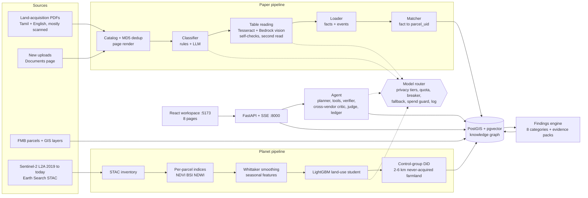
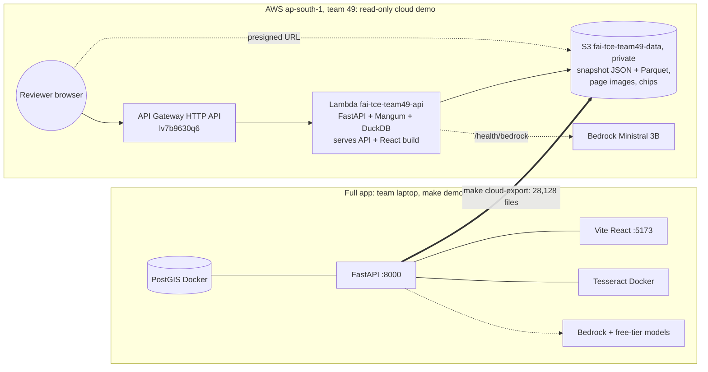

# NilaSaatchi AI: As-built Architecture (2026-09-28)

This document describes **what was actually built and runs today**. `plan.md` is the original design; `docs/decisions.md` (D-001…D-069) explains every change from it.

## 1. System at a glance

## 2. Components
| Component | Code | What it does | Key facts |
|---|---|---|---|
| Catalog | `pipeline/catalog` | Finds PDFs, MD5/SHA-256 dedup, renders page previews, detects text layers | 2,362 unique documents, 12,859 pages |
| Classifier | `pipeline/classify` | Header rules, then an LLM decision per document and page segment (type, legal stage, scheme relevance) | stage 0.90, type 0.80 on 100 labels |
| Table reading | `pipeline/extract` | Local Tesseract (tam+eng, Docker) for headers; Bedrock Ministral 3 8B vision for whole-page tables; arithmetic self-checks (totals, ha↔ac, amount = acres × rate, survey sanity incl. the row-serial check); a second read on failure; review queue | evidence (doc, page, bbox, model, confidence) on every value |
| Loader + matcher | `pipeline/load`, `pipeline/match` | Facts and acquisition events into the KG; links each to `parcel_uid = Village\|KIDE` | 42,380 facts, 15,342 events, 82.1% facts linked |
| Lifecycle | `db/views` | Per-parcel legal stage, days in stage, next expected stage; parcel- vs block-level evidence | `v_parcel_lifecycle`, `v_parcel_events` |
| Planet | `planet/` | STAC inventory, windowed COG reads, per-parcel indices, smoothing, seasonal states (LightGBM student trained on teacher labels), event windows, control-group DiD, chips | 588 scenes, 382,536 parcel observations |
| Satellite refresh | `planet/refresh.py` | Incremental: scenes newer than the latest → only affected parcels × seasons; resumable journal; no model calls | added the 2026-09-26 scene; re-run is a no-op |
| Findings | `pipeline/findings` | 8 categories (below) with an evidence pack per finding | 1,388 findings |
| Router | `app/router` | Every model call: filters by modality + privacy tier + quota + breaker + spend guard, scores, logs, validates JSON, falls back | `config/models.yaml`, `data/router_log.sqlite` |
| Agent | `app/agent`, `app/tools`, `app/ledger` | LangGraph: intake → planner → tools (guarded SQL, spatial, findings, evidence, timeline, satellite) → verifier → critic (different vendor) → judge → presenter; SHA-256 hash-chained ledger | 8/8 eval answers match SQL |
| Ingest | `app/ingest` | Upload → background job of 7 stages (store, catalog, classify, extract, load, match, findings), each a subprocess; optional declared document type; verification report (PDF/CSV/HTML) | 20/20 unseen uploads completed |
| API | `app/api` | FastAPI + SSE: stats, layers, parcels, findings, evidence packs, documents, runs, review, router, ingest | owner names masked by default; bank-like fields stripped |
| UI | `web/` | React 19 + Vite (JSX), MapLibre, ECharts, TanStack Table, Zustand, Tailwind | 8 pages; read-only cloud build via `VITE_READ_ONLY` |
| Cloud demo | `app/cloud`, `infra/cloud_demo` | Read-only API from a snapshot on Lambda | see §5 |

**Finding categories:**
- COMPENSATION_MISMATCH
- EXTENT_MISMATCH
- DOC_VERSION_CONFLICT
- FMB_QUALITY
- PV1_CLASSIFICATION_CONFLICT (land class vs satellite)
- PV3_POST_POSSESSION_ACTIVITY (vs control group)
- PV4_IDLE_LAND_BANK
- EXTRACTION_ERROR

## 3. Model routing policy
| Task | Chain (first → fallback) | Privacy tier |
|---|---|---|
| Table reading (owner pages) | Bedrock Ministral 3 8B vision → Groq Qwen VL → review queue | PII (non-training providers only) |
| Page classification | Bedrock Ministral 8B → Groq Qwen VL | PII |
| Text classification | Bedrock Ministral 3B → Groq gpt-oss → local | PII |
| Agent planner | Gemini flash-lite → Groq gpt-oss → Qwen → Cohere | PSEUDO (names tokenised) |
| Critic | always a vendor different from the planner | PSEUDO |
| Judge | Gemini → Cohere | PSEUDO |
| Text-to-SQL | Groq Qwen → gpt-oss | PUBLIC (schema only) |
| Satellite teacher | Gemini vision / Cohere vision on public chips | PUBLIC |
| Land use at scale | LightGBM student (local, no calls) | — |

- **Privacy rule:** PII goes only to models with `trains_on_free_tier: false`; an unknown policy is treated as "trains". Measured: 0 of 14,202 PII-tier calls went to a training-tier model.
- **Fallback:** a circuit breaker opens after 3 consecutive 429/5xx errors (skip for 60 s), then the chain moves on, ending at a terminal step (review queue / clarify). Chaos hook: `ROUTER_CHAOS=gemini:down`.

## 4. Data stores
- **PostgreSQL 16 + PostGIS + pgvector** (Docker, port 5439):
  - GIS base (`parcel`, `village`, `ref_layer_*`)
  - catalog (`document`, `page`, `document_segment`)
  - Paper (`extraction`, `parcel_fact`, `acquisition_event`, `owner`, `review_queue`)
  - Planet (`s2_scene`, `parcel_obs`, `parcel_season`, `parcel_did`, …)
  - agent (`run`, `run_event`, `agent_ledger`, `workspace*`)
  - uploads (`ingest_job`)
  - The agent uses the read-only role `agent_ro`, which cannot read owners or write anything.
- **Files (`data/`, git-ignored):** page previews, extraction JSON per page, satellite parquet snapshots and chips, the land-use model, router log, caches.

## 5. Deployment

- **Full app (local):** `make demo` (database, API, UI); `make demo-setup` or `SETUP-WINDOWS.cmd` on a new machine. The bundle is a 2.3 GB zip with a 49 MB database dump.
- **Cloud demo:**
  - **URL:** https://lv7b9630q6.execute-api.ap-south-1.amazonaws.com/
  - **Reads:** every GET the UI uses is served from the snapshot: per-entity JSON, lists filtered with DuckDB over Parquet, page images via presigned S3 redirects (the bucket stays private).
  - **Writes:** return 405, because uploads, the live agent and review actions need the database and Docker OCR (no RDS/EC2/ECR allowed).
  - **Bedrock from Lambda:** verified (167 ms).
  - **Concurrency:** the account allows ~10 concurrent Lambdas, so the UI retries throttled requests.
- **Commands:**
  - `make cloud-export`, `make cloud-package`, `make cloud-deploy`
  - `make cloud-down` to tear down
  - Resource log: `infra/RESOURCES.md`

## 6. Quality and safety controls
- **Evidence on every value**, confidence and caveats on every finding, and a review queue for failed checks.
- **Guarded SQL** (SELECT-only, a single statement, a table allow-list, a read-only role, a timeout). DROP, DELETE, stacked statements and owner reads are refused.
- **Tamper-evident ledger** (`make verify-ledger`).
- **Tests:** 928 backend, 13 UI e2e (+1 quota-dependent skip); measured metrics in `docs/metrics.md`.
- **Secrets and personal data:** keys only in `.env`; owner names masked in the UI and never committed; the dataset is not in the repository.
