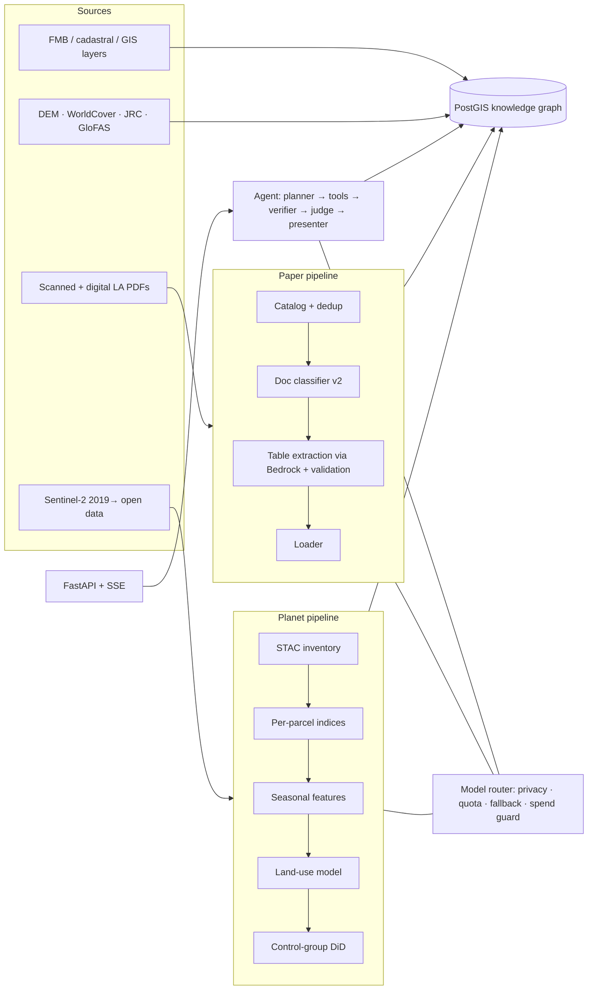

# 03 · Architecture and Tech Stack

## 1. The big picture
> The **as-built** diagrams (including uploads and the AWS cloud demo) are in [`docs/architecture.md`](../architecture.md). The picture below is the core data flow.


## 2. Tech stack and the reason for each choice
| Layer | Choice | Why |
|---|---|---|
| Language | Python 3.12 via `uv` | The system Python 3.14 has no PaddleOCR wheels; `uv` gives reproducible environments |
| Database | PostgreSQL 16 + **PostGIS** + **pgvector** (Docker, port 5439) | Spatial SQL (areas, buffers, intersections) and vector search in one store. LLMs know PostGIS SQL well. Ports 5432/5433 are used by other services on this machine |
| Geo | GeoPandas, Shapely 2, pyproj, rasterio, pystac-client | Standard open-source GIS; windowed reads of cloud-optimised GeoTIFFs |
| OCR | Tesseract 5 `tam+eng` (in a Docker image) | Free and local; good on Tamil prose/headers (not tables) |
| Table reading | **AWS Bedrock Ministral 3 8B (vision)** | Won the bake-off; private (AWS doesn't train on customer data); cheap (~$0.0005/page) |
| ML | LightGBM (land-use "student"), numpy/scipy (Whittaker smoothing) | Fast, CPU-only, explainable |
| Agent | LangGraph + Pydantic | Explicit state graph, typed state, checkpointing |
| Model access | Own router on top of LiteLLM / boto3 / Cohere v2 | Privacy tiers, quotas, fallback, spend guard, logging |
| API | FastAPI + server-sent events (SSE) | Streams live agent progress to the UI |
| Frontend | React 19 + Vite, JavaScript (JSX), MapLibre, ECharts, TanStack Table, Zustand, Tailwind | Team choice (D-011); free basemap; 8 pages; a read-only build for the cloud |
| Cloud | AWS ap-south-1 (Team 49): Bedrock (table reading), and a read-only demo on Lambda + API Gateway + private S3 (DuckDB over Parquet) | FarmwiseAI's approved services; no EC2/RDS allowed |

## 3. Repository map (what lives where)
```
plan.md · proposal.md · CLAUDE.md          plan, external proposal, agent operating guide
config/models.yaml                         model registry + task chains (router config)
db/migrations/0001…0012                    database schema (see §4)
pipeline/catalog|classify|gis|raster       Phase 1
pipeline/extract|normalize|load            Phase 2
planet/stac|extract|features|classify|controls|events|chips   Phase 3
app/router/                                model router (Phase 0/4)
app/api/  app/workspace/  app/export/      FastAPI service (Phase 4) + PDF/CSV export
app/agent/  app/tools/  app/ledger/        agent graph + tools + hash-chained ledger (Phase 4)
pipeline/match|findings  db/views/         matcher, lifecycle views, findings engine (Phase 5)
web/                                       React UI (Phase 6)
app/ingest/  planet/refresh.py             upload pipeline + report; incremental satellite refresh
app/cloud/  infra/cloud_demo/              read-only cloud demo (Lambda) + deploy/teardown
scripts/demo_*.sh|.ps1, *-WINDOWS.cmd      run on a new machine (Linux/macOS/Windows)
infra/bedrock_batch/                       Lambda batch worker (removed from AWS; kept for reference)
spikes/ocr_bakeoff/                        OCR bake-off (its Tesseract wrapper is still used)
ref/                                       material not used by the running app (old spikes, drafts)
eval/                                      golden, held-out, dev, dev2, classify labels, planet audit
docs/                                      decisions, metrics, progress, spikes, reviews, team/
tests/                                     ~930 automated tests (+ web/e2e Playwright)
data/                                      (git-ignored) caches, page images, rasters, results
```

## 4. Database (the knowledge graph)
| Table | Holds |
|---|---|
| `village`, `parcel` (PK `parcel_uid`), `survey`, `ref_layer_*` | GIS base, with precomputed distances to roads/substations/rail and areas (geodesic) |
| `fmb_qa_overlap`, `fmb_qa_outside_survey` | FMB quality issues |
| `document`, `page`, `document_segment` | Catalog + classification (form, stage, page sections) |
| `extraction`, `parcel_fact`, `acquisition_event`, `owner`, `review_queue` | Extracted facts with evidence; owner names hidden from the agent via `v_owner_pseudo` |
| `s2_scene`, `parcel_obs`, `parcel_season`, `planet_teacher_label`, `parcel_event_window`, `parcel_did` | Satellite pipeline outputs |
| `finding` (+ views `v_parcel_lifecycle`, `v_parcel_events`, `v_idle_land_bank`) | Findings with evidence packs; each parcel's legal stage |
| `workspace`, `workspace_version`, `run`, `run_event`, `agent_ledger` | API/agent state and the tamper-evident ledger |
| `ingest_job` | Upload and satellite-refresh jobs with per-step status |

The agent queries through a read-only role **`agent_ro`**, which cannot see owner names or write anything.

## 5. Cross-cutting engineering rules
- **Idempotent `make` targets**: every step can be re-run; results are cached by content hash.
- **Decision log** (`docs/decisions.md`), **metrics log** (`docs/metrics.md`), **progress board** (`docs/progress.md`).
- **Quality gates:** a phase closes only when its acceptance commands pass and an independent review passes (Phase 0 review: PASS).
- **Automated tests:** 928 backend tests (offline, recorded model responses) and 14 Playwright UI tests.
