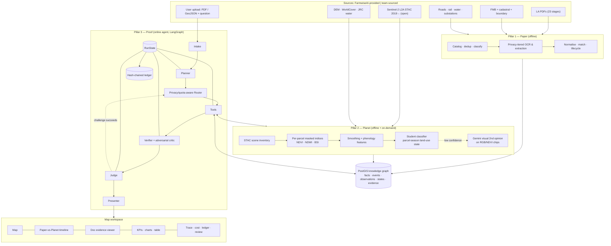

# NilaSaatchi AI — Master Implementation Plan
### நிலச் சாட்சி · "the land's witness" · **Paper vs Planet**

> **Task 1 (Multi-Model, Multimodal & Agentic AI), implemented on the Task 2 foundation (Land-Document Intelligence), with a satellite-evidence layer**
> FarmwiseAI Campus Product Challenge · Team MindSpark · Plan v2.0 · 2026-09-26

This document is the **single source of truth for implementation**. `proposal.md` is the external, business-facing version. Skills (`.claude/skills/`) and agents (`.claude/agents/`) take their instructions from this file. If they disagree, this file wins until `docs/decisions.md` records a change.

---

## 0. Decision record
| ID | Decision | Date |
|---|---|---|
| D-001 | Use case: land-acquisition intelligence for the Allikulam SIPCOT park, built on the Task 2 dataset | 2026-09-26 |
| D-002 | 2-week prototype window | 2026-09-26 |
| D-003 | Humans own and review the workstreams; AI agents implement; stated openly | 2026-09-26 |
| D-004 | Free tiers and local models only; ~~Bedrock is an optional fallback capped at US$5~~ superseded by D-027/D-028 (AWS adopted, $15 cap) | 2026-09-26 |
| **D-027/028** | **AWS adopted** (team 49, Builder-AI, Mumbai): Bedrock Ministral 3 8B vision = primary PII table reader; 3B = classification/JSON repair; Titan embeddings; S3 + DynamoDB; serverless deploy (API Gateway + Lambda + DuckDB-spatial on S3). Self-imposed cap **$15** | 2026-09-26 |
| D-005 | Privacy-tiered routing: PII only to no-training routes; Gemini free tier only for PSEUDO/PUBLIC content | 2026-09-26 |
| D-006 | Zero human implementation; the user is decision authority | 2026-09-26 |
| D-007 | PostGIS primary store; Python 3.12 via uv; local-first; AWS only as an approval-gated stretch goal | 2026-09-26 |
| **D-008** | **Pivot: "Paper vs Planet".** The headline becomes an agent that cross-examines each parcel's *document claims* against a *2019–2026 satellite time series* and produces evidence packs. Reuse is shown with an **agri-claims pack** (crop presence per season, as used for insurance and lending). Suitability is demoted to a minor feature. | 2026-09-26 |
| **D-009** | **Product name: NilaSaatchi AI** (நிலச் சாட்சி). Tagline: *Paper vs Planet*. | 2026-09-26 |

**Why the pivot (evidence, 2026-09-26)**
1. **Market scan.** Document-OCR → parcel → dashboard land portals are very common: dozens of SIH-2026 repos, and an official SIH26016 "Land Acquisition Management System" problem. Crop chatbots are common too, and FarmwiseAI already sells them.
2. **FarmwiseAI's profile.** It is a GeoAI and satellite company:
   - MapsAI crop intelligence
   - crop-insurance claim verification
   - satellite loan-utilisation checks
   - a "GIS-based Land Acquisition & Management" product line
   - SIPCOT and the Directorate of Survey & Settlement among the logos on its site
   - FMB georeferencing already in-house
3. **The gap.** No product found systematically verifies acquisition *documents* against the *satellite record*.
4. **Spike (`docs/spikes/sentinel2-spike.md`).**
   - 587 unique Sentinel-2 acquisitions over the park, 2019–2026 (122 with < 20% cloud), free and anonymous.
   - Per-parcel NDVI for the whole park in minutes on CPU (reproduced in P0 by `make s2-spike`).
   - With production settings (latest processing baseline, native UTM grid, −5 m edge buffer), **444 of 1,073 analysable parcels** show a crop-like seasonal cycle both before acquisition and after possession. The single-date threshold behind this count is provisional; P3 replaces it with smoothed phenology.
   - Worked example: Melathattaparai surveys 233/235 were handed over on 21.03.2025, yet NDVI was 0.76 on 2025-12-23.

---

## 1. Executive summary

**The one-line pitch.** *Every land-acquisition file tells a story on paper. NilaSaatchi asks the land itself to testify.*

NilaSaatchi is a reusable **planner → router → tools → verifier → judge → presenter** agent system with three pillars:

| Pillar | What it does | Challenge fit |
|---|---|---|
| **Paper** | Reads 12.5k scanned Tamil/English acquisition pages, extracts claims with evidence boxes, links them to FMB parcels, and builds each parcel's legal-stage timeline | Task 2 foundation |
| **Planet** | Builds a per-parcel Sentinel-2 time series (2019→today) and classifies each parcel-season: cropped, irrigated/double-cropped, perennial trees/scrub, bare/fallow, cleared/built, water | Multimodal satellite intelligence (FarmwiseAI's core) |
| **Proof** | An agent cross-examines paper against planet: classification claims, standing crops or trees at award, activity after possession, speculative change before notification, idle land bank. The output is **evidence packs**: document page with bbox, satellite chips, timeline chart, verdict, confidence and ledger hash | Task 1 agentic core: planning, routing, verification, fallback, state |

**The signature visual.** For any parcel, one chart places the **document events** (3(1) → award → payment → possession → mutation) on top of the **satellite vegetation curve**. The mismatch is obvious at a glance.

**Why it wins.**
- **Unique:** nobody in the market scan does this.
- **Useful:** it directly extends FarmwiseAI's claim-verification and land-acquisition products.
- **Demonstrable:** a real finding on real parcels.
- **Feasible:** spiked, free, CPU-only.
- **Rubric-complete:** it covers every Task 1 and Task 2 capability (§2).

---

## 2. Challenge-requirement traceability

### 2.1 Task 1 — must demonstrate
| Requirement | Component |
|---|---|
| ≥2 proprietary + ≥1 open-weight model, justified roles | **Gemini** (planner, judge; **visual second opinion on satellite chips**, which are PUBLIC and carry no PII); **Cohere Command A** (adversarial critic, judge fallback) and **Cohere Command A Vision** (independent second vision teacher on satellite chips, for two-teacher consensus with Gemini). Mistral OCR was dropped because its API needs a billing method (D-018). Open: **Qwen3.8-27B / gpt-oss-120b** on Groq (SQL, JSON, cell re-read), **LightGBM phenology "student"** (small model, runs every parcel-season), **PaddleOCR/Tesseract**, **BGE-M3** |
| Multimodal input | Scanned PDFs, digital extracts, satellite imagery (multispectral time series + RGB chips), vectors, tables, user uploads (PDF/GeoJSON) |
| Planner, router (task/capability/confidence/latency/cost) | LangGraph planner; policy router with quota, privacy and circuit breakers (§5.6) |
| Tool/data connectors ≥2 | 13 tools, including STAC satellite retrieval, SQL, spatial, raster, OCR and verification (§5.5) |
| Structured outputs driving the UI | `WorkspaceSpec` and `EvidencePack` schemas |
| Verifier and fallback | Deterministic checks + cross-vendor adversarial critic + judge; small model first → VLM → field-verification queue |
| Shared state | Typed `RunState`, Postgres checkpointer, hash-chained ledger |
| Latency/cost comparison | Telemetry + shadow cost; routed vs all-proprietary vs all-open report |
| Unseen request, no hard-coding | Generic graph; 25-query unseen suite; agri-claims pack on arbitrary uploaded polygons |

### 2.2 Task 2 — must demonstrate
| Requirement | Component |
|---|---|
| ≥3 data types | PDFs, GeoJSON, satellite rasters (S2 time series, DEM, WorldCover, JRC water), tabular KG |
| Extraction and document-to-parcel matching | Pillar Paper (P2) + matcher (P5) |
| Attribute query + multi-layer spatial query | e.g. "Block-5 parcels awarded but unpaid"; "possessed parcels within 5 km of a major road, still cultivated in 2025 and outside waterbodies" |
| Visible SQL/GIS generation | SQL panel with the guarded, generated SQL and raster operations |
| Synchronised doc/map/chart/table/dashboard | Cross-filter store (P6) |
| NL modify, save, export | Workspace versions; GeoJSON/CSV/PDF export; evidence-pack PDF |
| Raster integration (Task 2 guide) | Copernicus DEM/slope, ESA WorldCover, JRC surface water, **Sentinel-2 time series** |

---

## 3. Dataset analysis (details in the `land-domain-knowledge` skill)
| Fact | Value | Design implication |
|---|---|---|
| Scope | Allikulam SIPCOT park, 7 villages, 1,242 FMB parcels | Deep per-parcel analysis is feasible |
| PDFs | 3,212 → **2,361 unique**; 186 duplicate groups cross folders | Hash dedup; multi-stage labels |
| Pages | 18,644 → **12,564 unique**; mostly scanned Tamil; some handwriting | Local OCR for bulk; selective VLM |
| Noise | Misfiled documents; a *Solar Power Plant (Tirunelveli)* gazette mixed in | Content classifier and scheme filter |
| Totals drift | Sanctioned (GO + English AS letter) 904.40 ha · Tamil proposal 911.395 ha (+6.995 ha) | A real document-drift finding (D-014) |
| FMB quality | 366 overlapping parcel pairs (7.3 ha double-counted); geodesic sum 908.82 ha vs dissolved union 901.50 ha; 28 parcels spill outside their survey | FMB QA findings; area totals must be reported as dissolved union (D-023) |
| Arithmetic | Award = acres × rate (2.52 × ₹5,00,000 = ₹12,60,000) | Deterministic verifier |
| Timeline | GO Feb 2021 → 3(1) Oct–Nov 2022 → awards 2024–25 → possession certificates ~Mar 2025 | Before and after windows are well covered by Sentinel-2 (2019→) |
| Satellite | 587 unique acquisitions (baseline duplicates collapsed), 122 with < 20% cloud, 2019–2026, tile 43PHK. Sparse in Jul–Nov (monsoon) | Smoothed phenology; S1 SAR as a stretch gap-filler |
| OCR spike | Tesseract Tamil: prose OK, table cells fail | Justifies the routing |
| Missing | Ownership DB, government-land layer, rasters | Build from chitta/awards; derive from poramboke; source free rasters |

---

## 4. Users, hero requests and scope

### 4.1 Personas and the questions only NilaSaatchi answers
| Persona | Question |
|---|---|
| SIPCOT project officer | "Which parcels we took possession of are *still being cultivated*? Show evidence packs." |
| Special Tahsildar (LA) | "Did any parcel change land use between notification and award, for example sudden planting that would inflate compensation?" |
| District Collector | "How much acquired land is sitting idle, by block, and what is its road and power access?" |
| Compensation auditor | "Do award classifications (dry/wet) and tree compensation match what the satellite saw?" |
| FarmwiseAI agri-claims analyst (reuse pack) | "For this uploaded farm polygon, was a crop grown in rabi 2023–24? Was it fallow for two seasons?" |

### 4.2 Demo requests (they live only in `eval/queries.yaml`, never in code)
1. **Paper vs Planet, one parcel:** "Verify Melathattaparai survey 233: what do the documents claim, and what does the satellite show?"
2. **Park-wide sweep:** "Find parcels with possession taken but still cultivated after possession; rank them by confidence and build a dashboard."
3. **Compensation integrity:** "List parcels whose land use changed between 3(1) notification and award."
4. **Document drift:** "Do the proposal, the sanction (GO/AS) and the GIS layer agree on village extents?"
5. **Upload (Example A):** a new award PDF → extract → match → cross-examine each parcel.
6. **Reuse:** upload a GeoJSON of farm plots → per-season crop presence and a fallow-streak report.
7. **Unseen request** chosen by the evaluators.

### 4.3 Scope
- **In scope:**
  - all 7 villages
  - all documents classified and header-extracted (the stage, date, block and survey refs power the lifecycle)
  - **full table extraction for the priority types:** GO/AS/LPS, 7(2)/7(3) awards, Form F, LDR/possession, chitta
  - Sentinel-2 series from 2019 to the present for all parcels
  - the agri-claims pack for any polygon inside tile 43PHK (100 × 100 km)
- **Stretch:**
  - Sentinel-1 SAR monsoon gap-fill
  - FMB boundary-vs-field-edge QA
  - AWS deployment
  - voice
- **Out of scope:**
  - legal determinations
  - writing back to government systems
  - live TN e-services connections

---

## 5. Solution architecture

### 5.1 Layer view


### 5.2 Pillar 1 — Paper pipeline (`make catalog classify ocr extract resolve load`)
The paper pipeline is kept from v1, with the scope narrowed for the quota budget.
1. **Catalog, dedup and render:** sha256/MD5 groups; pages rendered at 150 and 300 dpi.
2. **Classify** by content (folder name is only a prior), plus scheme relevance.
3. **OCR:**
   - text layer → PaddleOCR `ta` + Tesseract `tam+eng` vote
   - layout splits prose from table regions (OpenCV ruling lines)
4. **Headers for all documents:** type, village, unit, block, doc no, date, survey refs. These produce the `acquisition_event` rows.
5. **Tables for priority types:**
   - typed cell OCR → schema + self-consistency (totals, ha↔ac, amount = ac × rate)
   - escalation by privacy tier: local cell OCR (two-engine vote) → Groq Qwen vision (open-weight, no training) → review
6. **Extra claims for Proof:**
   - land classification per row (புன்செய்/நன்செய்/புறம்போக்கு; dry/wet/poramboke)
   - mentions of trees, wells or structures (மரம், கிணறு, கட்டிடம்) and their compensation lines
   - possession/handover dates
   - boundary descriptions
7. **Normalise and resolve** to FMB `KIDE` (candidates kept). **Lifecycle** state machine per parcel.

### 5.3 Pillar 2 — Planet pipeline (`make s2-inventory s2-extract s2-features s2-classify`)
1. **Inventory.**
   - Query Earth Search STAC for `sentinel-2-l2a` over the AOI (park + 2 km) from 2019-01-01 to today, and also over any uploaded polygons.
   - Keep every scene. The per-parcel valid-pixel fraction from the SCL decides usability.
   - Deduplicate same-day processing baselines (`_0/_1/_2` suffixes) by taking the latest.
2. **Extract.**
   - Windowed COG reads (`/vsicurl`, rasterio) of B02, B03, B04, B08, B11 and SCL, clipped to the AOI once per scene and cached as `data/s2/{date}.tif`.
   - Per parcel, using a 5 m inward buffer to reduce mixed pixels: median NDVI, NDWI, BSI (bare soil) and NDBI, plus valid_frac and pixel count.
   - Written to `parcel_obs`. Parcels under 10 valid pixels are flagged `low_support`.
   - Estimate: about 400 scenes × ~5 s ≈ 35 min on 12 workers.
3. **Features per parcel per agricultural year (Jun–May) and per season:**
   - Seasons: Kharif Jun–Sep, NE-monsoon/Rabi Oct–Feb, Summer Mar–May.
   - Smoothing: Whittaker or Savitzky–Golay over the cloud-free observations, with gaps interpolated under a maximum gap of 45 days (gaps are flagged).
   - Features: max, min, amplitude, dry-season mean, green-up count (peaks > 0.45), peak date, integral, BSI in the dry season, NDWI max, and trend versus the previous year.
4. **Classify each parcel-season** into `cropped`, `irrigated_multi`, `perennial_veg` (trees/Prosopis scrub), `bare_fallow`, `cleared_or_built` or `water`.
   - **Teacher labels** (PUBLIC tier; satellite imagery has no PII):
     - (a) ESA WorldCover 2021 class fractions as weak labels
     - (b) **Gemini visual labels** on ~300 stratified parcel-seasons, given true-colour and NDVI chips plus the time-series plot, with the answer returned as JSON with a rationale
     - (c) rule priors
   - **Student:** LightGBM on the phenology features. Validation is spatially blocked, holding out whole villages, to avoid leakage. The student produces a probability.
   - **Routing at runtime:** student probability ≥ τ → accept. Below τ → Gemini visual second opinion. If they disagree → `needs_field_verification`.
5. **Event-window analysis.** For each parcel with document events, compute the land-use state in windows:
   - `[T_3(1) − 12 months, T_3(1))`
   - `[T_3(1), T_award)`
   - `[T_award, T_possession)`
   - `[T_possession, now]`
6. **Stretch:**
   - Sentinel-1 RTC (Planetary Computer, anonymous SAS token) VH/VV backscatter to fill monsoon gaps.
   - Edge-alignment QA of FMB boundaries against field edges from NDVI gradients, which complements FarmwiseAI's georeferencing work.

### 5.4 Pillar 3 — Proof: Paper-vs-Planet checks
Every check produces a `Finding` with `{category, kide, paper_claim(evidence), planet_observation(evidence), verdict, confidence, caveats[]}`. The wording is always *"signal requiring field verification"*.

| Code | Check | Paper side | Planet side |
|---|---|---|---|
| **PV1** CLASSIFICATION_CONFLICT | Is the stated land class consistent with what was seen? | Row classification: dry, wet or poramboke | Wet → expect irrigated_multi or dry-season green. Dry → mostly single rainfed cycle. Poramboke → cultivation means an encroachment signal |
| **PV2** STANDING_ASSET_CONFLICT | Were trees or crops compensated consistently? | Award/Form F tree, well or crop compensation lines (or "excluding trees") | perennial_veg at the award date, or its absence |
| **PV3** POST_POSSESSION_ACTIVITY | Is the land still farmed after handover? | LDR/possession date | **Difference-in-differences vs a control group** of non-acquired farmland (2–6 km ring outside the park) + a ploughing signature (BSI rise 2–6 weeks before green-up) + relative amplitude/peak timing. Absolute "cropped" state is not enough: rabi green-up is near-universal (D-035) |
| **PV4** IDLE_LAND_BANK | Is acquired land being used? | Possession ≥ 6 months ago | No cleared_or_built transition; reported as an idle ha inventory by block with road/substation access |
| **PV5** PRE_NOTIFICATION_CHANGE | Did land use change suspiciously while acquisition was pending? | 3(1) date → award date | A land-use transition in `[T_3(1), T_award)`, for example bare → perennial (planting) or new structures |
| **PV6** WATER_CONFLICT | Is the land class plausible given water? | Dry classification | High NDWI/JRC water occurrence; tank overlap |

These are added to the v1 document-side categories: MISSING_IN_GIS, MISSING_IN_DOCS, EXTENT_MISMATCH, OWNER_MISMATCH, STAGE_ORDER_VIOLATION, STALLED, EXEMPTION_CONFLICT, DOC_VERSION_CONFLICT, COMPENSATION_MISMATCH and OUT_OF_SCOPE_DOC.

**Evidence pack (`EvidencePack` schema → UI panel and PDF)**
- parcel map inset
- the document snippets, as page crops with bbox, in their original Tamil
- the timeline chart (document events over the NDVI/BSI curves)
- satellite chips at the key dates (true colour and NDVI)
- the checks run and the critic's challenge with its result
- verdict and confidence, caveats
- the ledger hash

### 5.5 Tool catalog (every tool returns `{data, evidence[], sql|code?, confidence}`)
| Tool | Purpose |
|---|---|
| `catalog_search` | Documents by type, village, block, date or stage |
| `doc_retrieve` | Hybrid semantic + FTS search over pages (BGE-M3 + tsvector, RRF) |
| `extract_document` | OCR and extract an uploaded file (privacy-tiered) |
| `sql_query` | Guarded text-to-SQL over the KG (Qwen → sqlglot guard → `agent_ro`) |
| `spatial_query` | PostGIS templates (buffer, intersect, distance, area); generated SQL, guarded, as fallback |
| `match_parcels` | Document rows → FMB with candidates |
| `lifecycle_status` | Stage timeline, stalled detection |
| `satellite_timeseries` | Per-parcel or per-polygon indices and states; fetches from STAC on demand for uploads |
| `satellite_chip` | True-colour/NDVI chip PNGs for a parcel and date (evidence and VLM input) |
| `landuse_state` | Parcel-season state with student probability; escalates to the VLM |
| `paper_vs_planet` | Runs PV1–PV6 plus the document categories for a scope → Findings |
| `evidence_pack` | Assembles an `EvidencePack` |
| `compose_workspace` | Builds or patches the `WorkspaceSpec` |

### 5.6 Model lineup and routing (IDs in `config/models.yaml`, verified by `make doctor`)
| Role | Primary | Fallbacks | Privacy tier |
|---|---|---|---|
| Planner / intent | Gemini `gemini-3.5-flash-lite` *(proprietary A)* | gemini-3.8-flash (hard replans) → Groq Qwen3.8 → local qwen3.5:4b | PUBLIC/PSEUDO |
| **Satellite visual 2nd opinion / teacher** | Gemini flash-lite multimodal on chips + plot | Groq Qwen3.8 vision → field-verification queue | **PUBLIC** (imagery, no PII) |
| Parcel-season land-use state | **LightGBM student** *(small, local)* | → VLM when uncertain | Local |
| Text-to-SQL / JSON / tool args | Groq `qwen/qwen3.8-27b` *(open-weight)* | gpt-oss-120b → Bedrock Ministral 3 8B → local | PII-OK |
| **PII table reader** | **Bedrock `mistral.ministral-3-8b-instruct` (vision)** *(open-weight, hosted on AWS; AWS doesn't train on customer data)*, after the local two-engine OCR vote for headers | Groq Qwen3.8 vision → review queue | PII-OK |
| Classification / JSON repair (cheap) | **Bedrock `mistral.ministral-3-3b-instruct`** | Groq gpt-oss-120b → local | PII-OK |
| Satellite second vision teacher / second opinion | **Cohere Command A Vision** *(proprietary B)* | Groq Qwen vision → field verification | PUBLIC |
| Adversarial critic | A different vendor from the producer: Gemini, Qwen or **Cohere Command A** *(proprietary B)* | deterministic-only | PSEUDO |
| Judge | Gemini flash-lite (PSEUDO) | Cohere → deterministic-only | PSEUDO |
| Presenter (EN/TA narrative) | Gemini flash-lite (PSEUDO; names re-inserted locally) | Qwen3.8 | PSEUDO |
| Bulk OCR | PaddleOCR `ta` + Tesseract | Groq Qwen vision on disputed crops | Local |
| Embeddings | **Amazon Titan Text Embeddings V2** *(proprietary, AWS)* for page search; **Titan Multimodal Embeddings** for satellite-chip / page-image similarity | BGE-M3 (local) | PII-OK (AWS) |

**Router rules**
- **Hard filters:** modality, privacy tier (fail closed on an unknown training policy), context length, circuit breaker, quota reserve.
- **Score:** 0.35·capability + 0.25·expected confidence − 0.15·latency − 0.10·shadow cost − 0.15·quota pressure. Every choice is logged with its reasons.
- **Quota DB:** chaos hook, VCR fixtures for CI.
- **Shadow cost:** list prices against the actual cost of $0.

**The small-first pattern, twice:**
- documents: local two-engine OCR (headers/prose) → Bedrock Ministral 3 8B vision (tables) → Groq Qwen vision → human
- satellite: LightGBM student → Gemini teacher, cross-checked by Cohere Vision → field verification

### 5.7 Verification design
1. **Deterministic checks:**
   - area recomputation; document vs GIS extent
   - table totals; ha↔ac; amount = ac × rate
   - stage-order legality; date sanity; bbox-contains-value
   - satellite: minimum observation count per window, gap length, valid fraction, low-support flag, and *two independent indices must agree* (for example cropped means an NDVI amplitude *and* a dry-season BSI rise)
2. **Adversarial critic** (a different vendor) must return a *testable* challenge. Examples:
   - "The post-possession greenness is a weed flush, not a crop." The test is the peak shape and the timing versus rainfall onset, compared across neighbouring parcels.
   - "The OCR read 233 but the page says 238." The test is re-reading the cell with a second engine.
   The system runs the test.
3. **Judge** verdicts are ACCEPT, DOWNGRADE, REROUTE or REVIEW, with calibrated confidence.
4. **Scope:** every KPI, every finding in an evidence pack, and every number in the narrative.

### 5.8 Fallback matrix
| Failure | Recovery | Demo? |
|---|---|---|
| Provider 429/5xx/timeout | Retry once → next model → circuit open | ✅ Chaos toggle |
| Schema-invalid JSON | Repair once → alternate model | ✅ |
| Low OCR confidence | Cell OCR → Qwen vision → review | ✅ |
| Low satellite confidence (clouds, gaps, mixed pixels) | Widen the window → S1 (stretch) → VLM visual → `needs_field_verification` | ✅ |
| STAC endpoint down | Cached scenes → Planetary Computer STAC mirror | ✅ |
| Critic challenge succeeds | Re-route (max 2) → downgrade + review | ✅ |
| SQL error | Error-guided repair (max 2) → template → clarify | ✅ |
| Quota exhausted | Next provider → local; degraded banner | ✅ |

### 5.9 Ledger
`hash_n = SHA256(prev ‖ run_id ‖ seq ‖ node ‖ canonical_json(payload))`. `make verify-ledger` checks the chain. The ledger head is stored in workspaces and evidence packs, and the demo includes a tamper test.

### 5.10 Knowledge-graph model (PostGIS 16 + pgvector)
**Key rule (D-020):** parcels are identified by `parcel_uid = '<canonical village>|<KIDE>'`, because `KIDE` repeats across villages. Every table below that says kide means parcel_uid.

The v1 tables stay: `village`, `parcel`, `survey`, `document`, `page`, `extraction`, `owner`, `parcel_fact`, `acquisition_event`, `discrepancy`, `ref_layer_*`, `run`, `ledger`, `workspace`. Added:
```
s2_scene(id, datetime, tile, cloud, baseline, hrefs jsonb, aoi_cache_path)
parcel_obs(parcel_uid|polygon_id, scene_id, date, ndvi, ndwi, bsi, ndbi, valid_frac, n_px, low_support)
parcel_season(parcel_uid|polygon_id, ag_year, season, features jsonb, state, p_state, teacher_label, teacher_src, route, needs_field)
finding(id, parcel_uid, category, paper_evidence_ids[], planet_evidence jsonb, verdict, confidence, caveats[], run_id)
upload_polygon(id, workspace_id, name, geom)   -- agri-claims pack
```
**Views:**
- `v_parcel_status`
- `v_parcel_timeline` (events ∪ seasonal states)
- `v_idle_land_bank`
- `v_findings_open`

### 5.11 Workspace layout
```
┌ NL bar (EN/தமிழ்) + attach ──────────────── [Chaos] [Demo mask] [Save] [Export ▾] ┐
│ Plan & route panel │                 MAP                      │ Evidence pack       │
│ step·model·why·ms·$│  parcels by finding / state / stage      │ doc crop (Tamil)    │
│                    │  time slider (season) · legend           │ satellite chips     │
├──── PAPER-vs-PLANET TIMELINE: doc events ▼ over NDVI/BSI curve (selected parcel) ───┤
├──── KPI cards ── Charts (findings by category/village, idle ha by block) ── Table ───┤
├──── Verification & ledger · Review / field-verification queue · Visible SQL ────────┤
```
The **season time slider** re-colours the map by land-use state per season. Scrubbing across the possession date is the demo's key moment.

---

## 6. Technology stack
| Layer | Choice |
|---|---|
| Runtime | Python 3.12 via `uv`; Node 24 |
| Agent | LangGraph 1.2.x, Pydantic v2, LiteLLM under our own policy router |
| API | FastAPI + SSE |
| DB | PostGIS 16 + pgvector (docker) |
| Geo / EO | GeoPandas, Shapely 2, pyproj, **rasterio**, **pystac-client**, rio-cogeo, numpy/scipy (Whittaker/SG), **LightGBM**, GDAL docker for CLI |
| Satellite data | Earth Search STAC (AWS open, anonymous) primary; Planetary Computer STAC as a mirror and for S1 |
| OCR / docs | PaddleOCR 3.7 (`ta`), Tesseract 5 `tam+eng`, pypdfium2, OpenCV |
| Text | RapidFuzz, indic-transliteration, sqlglot, jsonschema |
| Frontend | **React 19 + Vite, JavaScript (JSX)** (D-011), MapLibre GL, ECharts, react-pdf, TanStack Table, Zustand, Tailwind/shadcn; API contracts checked at runtime with zod schemas generated from OpenAPI |
| Reports | HTML → Playwright PDF (evidence packs, workspace reports) |
| Testing | pytest, hypothesis, VCR fixtures, Playwright |
| **Cloud (D-027)** | AWS ap-south-1: Bedrock (Ministral 3 3B/8B, Titan Text V2 + Multimodal embeddings), S3 `fai-tce-team49-data` (private), DynamoDB (runs, ledger, workspaces), Lambda + API Gateway (API, extraction worker, satellite worker), DuckDB-spatial over GeoParquet in S3 as the cloud KG (no RDS), CloudWatch Logs. Local PostGIS stays the dev/analysis store. Cap $15 (`make aws-cost`) |

---

## 7. Repository structure
```
farmwiseAi/
├─ plan.md · proposal.md · CLAUDE.md · README.md · Makefile · docker-compose.yml · .env(.example)
├─ .claude/skills/*  ·  .claude/agents/*
├─ config/models.yaml · thresholds.yaml · aliases.yaml · seasons.yaml
├─ db/migrations/ · db/views/
├─ pipeline/{catalog,classify,ocr,extract,normalize,match,lifecycle,discrepancy,raster,load}/
├─ planet/{stac,extract,features,classify,chips,s1}/
├─ app/{api,agent,router,tools,ledger,workspace,export}/  app/domains/{land_acquisition,agri_claims}/
├─ prompts/ · schemas/{extraction,agent,evidence}/
├─ web/
├─ eval/{golden,queries.yaml,extraction,matching,planet,agent}/
├─ spikes/ · docs/{progress,decisions,metrics,escalations,spikes,reviews,screens}/
├─ data/ (git-ignored)   Dataset/ Documents/ (read-only, git-ignored)
```

---

## 8. Phases (14 days)

```mermaid
gantt
  dateFormat D
  axisFormat D%d
  section Foundation
  P0 Bootstrap & spikes            :p0, 0, 2d
  P1 Data foundation               :p1, 1, 3d
  section Pillars
  P2 Paper - document intelligence :p2, 2, 6d
  P3 Planet - satellite evidence   :p3, 2, 5d
  P4 Agentic core                  :p4, 4, 5d
  section Product
  P5 Proof - verification & analytics :p5, 7, 5d
  P6 Workspace UI                  :p6, 7, 5d
  section Close
  P7 Validation & demo             :p7, 11, 3d
```


| Phase | Days | Skill | Owners | Key exit criteria |
|---|---|---|---|---|
| **P0 Bootstrap & spikes** | 0–1 | `phase0-bootstrap` | data-engineer, agent-architect | `make doctor` green with the 4 keys; OCR bake-off report (D-010 thresholds); the S2 spike re-runs from the repo |
| **P1 Data foundation** | 1–3 | `phase1-data-foundation` | data-engineer, gis-engineer | 3,212/2,361/12,564 counts; FMB totals within 0.5%; classifier ≥ 90%; rasters + zonal stats for 1,242 parcels; STAC inventory stored |
| **P2 Paper** | 2–7 | `phase2-document-intelligence` | doc-intel-engineer | Header fields ≥ 95%; priority-table survey ≥ 92%, extent ≥ 90%, owner ≥ 85%; classification-claim ≥ 90%; possession dates ≥ 95%; ≥ 85% of parcels have ≥ 1 event; 0 PII to training tiers |
| **P3 Planet** | 2–6 | `phase3-satellite-evidence` | **eo-engineer** | `parcel_obs` for all parcels × all scenes; features per season; student macro-F1 ≥ 0.80 vs teacher labels on held-out villages; the Gemini-teacher sample audited by qa (≥ 50 chips checked from images); spike numbers reproduced |
| **P4 Agentic core** | 4–8 | `phase4-agentic-core` | agent-architect, backend-engineer | 12 dev queries end-to-end with valid specs; plan validity ≥ 95%; tool success ≥ 90%; chaos suite passes; ledger tamper detected; 0 PII leaks |
| **P5 Proof** | 7–11 | `phase5-verification-analytics` | gis-engineer, eo-engineer, agent-architect | PV1–PV6 + document rules with tests; match P ≥ 95% / R ≥ 85%; evidence packs for the top 20 findings; drift reproduces the GO/AS deltas; agri-claims pack answers polygon queries; unseen suite ≥ 85% |
| **P6 Workspace UI** | 7–11 | `phase6-workspace-ui` | frontend-engineer, backend-engineer | Timeline chart + season slider + evidence pack; cross-filter; save/reopen/export; Playwright e2e for 4 flows |
| **P7 Validation & demo** | 11–13 | `phase7-validation-demo` | qa-evaluator, docs-writer | All §10 metrics measured; route comparison; `make demo` passes twice from clean; final sign-off |

**Cut list** (in order): AWS Lambda deploy of the full API (keep Bedrock + S3) → S1 SAR → FMB edge QA → PDF export (keep CSV/GeoJSON) → Tamil UI labels → suitability tool (the multi-layer query is still met by PV4 plus the road/substation filters).

---

## 9. Agent team and skills map
| Agent | Model | Owns | Skills | Phases |
|---|---|---|---|---|
| Lead (main session) | — | Plan, dispatch, integrate, gates, escalations | `phase-gate` + the current phase skill | All |
| data-engineer | sonnet | Catalog, classify, rasters, migrations, compose | land-domain-knowledge, phase0, phase1 | P0–P2 |
| doc-intel-engineer | opus | OCR, extraction, normalisers | land-domain-knowledge, free-model-router, phase2 | P0, P2 |
| **eo-engineer** | opus | STAC, per-parcel indices, phenology, student/teacher, chips, S1 | land-domain-knowledge, free-model-router, phase3 | P0, P3, P5 |
| gis-engineer | opus | Schema, matcher, lifecycle, rules, spatial tools | land-domain-knowledge, phase1, phase5 | P1, P5 |
| agent-architect | opus | Graph, router, gateway, verifier, ledger, domain packs | free-model-router, land-domain-knowledge, phase4, phase5 | P0, P4, P5 |
| backend-engineer | sonnet | API, SSE, workspace, export, evidence-pack PDF | phase4, phase7 | P4, P6, P7 |
| frontend-engineer | sonnet | React workspace, timeline, slider | phase6 | P6 |
| qa-evaluator | opus | Gates, golden sets, satellite label audit, evals | phase-gate, land-domain-knowledge, phase7 | All gates |
| docs-writer | sonnet | README, architecture, eval report, demo script | phase7 | P7 |

**Parallelism**
- Day 2–7: doc-intel ∥ eo ∥ agent-architect (fixtures) ∥ gis.
- Day 7–11: frontend ∥ gis/eo (Proof) ∥ backend.

---

## 10. Evaluation plan
| Area | Metric | Target |
|---|---|---|
| Classification | Doc-type accuracy; out-of-scope flagged | ≥ 90%; 100% of known cases |
| Extraction | Field exact-match on priority tables; headers; classification claim; possession date | §8 P2 |
| Matching | Precision / recall | ≥ 95% / ≥ 85% |
| Planet | Student macro-F1 vs audited teacher labels (village-blocked); agreement with WorldCover 2021 cropland/tree fractions; qa audit of 50 Gemini labels from the images | ≥ 0.80; reported; ≥ 85% agree |
| Proof | Precision of PV findings on a qa-audited sample of 40 (from document + chip evidence); seeded-error catch rate of the verifier | ≥ 80%; ≥ 70% |
| Agent | Plan validity, tool success, verified-claim rate | ≥ 95%, ≥ 90%, ≥ 90% |
| End-to-end | Unseen-query rubric | ≥ 85% |
| Robustness | Chaos drills | 100% |
| Efficiency | p50 latency (warm); shadow cost routed vs all-proprietary | ≤ 25 s; reported |
| Privacy | PII payloads to training-tier models | 0 |

**Honesty rule.** There is no field ground truth. Planet metrics are reported against teacher labels and audits, and every finding carries a "field verification recommended" caveat.

---

## 11. Feasibility
### 11.1 Compute (16 cores, 44 GB RAM, no GPU)
| Job | Estimate | Basis |
|---|---|---|
| Page render + OCR of 12.5k pages | ~2–4 h one-off | 12 workers |
| Embeddings | ~1–2 h | BGE-M3 on CPU |
| **S2 extraction** (~400 scenes × AOI window) | ~30–60 min | P0 reproduction: 7 scenes × ~1.1k parcels in 2m38s cold, ~50 s cached, single process |
| Features + LightGBM | Minutes | Small tabular data (~1.2k parcels × ~28 seasons) |
| Online query | 8–25 s | 6–12 calls |

### 11.2 Free-quota budget
| Route | Capacity (verify in P0) | Use |
|---|---|---|
| Local OCR / LightGBM / BGE-M3 | Unlimited | Bulk |
| Earth Search STAC + COGs | Anonymous, open data | All satellite data |
| Groq Qwen3.8 (200K TPD) / gpt-oss (200K TPD) | ~100–200 calls/day each | Cell disputes, SQL |
| Gemini flash-lite (~500 RPD) | ~500/day | Planner, judge, presenter, **~300 one-off teacher labels** (spread over 2 days) plus runtime visual second opinions |
| Cohere trial (Command A + Vision share 1,000 calls/month) | ~30/day | Critic, fallback judge, ~150 one-off second-teacher labels on satellite chips |

The planet pillar adds **almost no quota pressure**: bulk work is local, and the VLM is used only for teacher labels and uncertain cases.

### 11.3 Risk register
| # | Risk | Mitigation |
|---|---|---|
| R1 | Free limits change | Registry, daily doctor, fallback chains, fixtures, capped Bedrock |
| R2 | Tamil table OCR accuracy (no proprietary Tamil OCR after dropping Mistral) | Cell OCR, two-engine voting, Qwen vision re-read, arithmetic self-consistency, review; priority-type scope |
| R3 | PII leakage | Router hard filter, gateway, audit query |
| R4 | **Satellite ambiguity** (weeds vs crops, mixed pixels, monsoon gaps) | Multi-index agreement, phenology shape, neighbour context, VLM second opinion, low-support flags, "field verification" wording; S1 stretch |
| R5 | **No field ground truth** | Teacher/audit protocol; WorldCover agreement; findings framed as leads; state it openly |
| R6 | Sensitive framing (findings could imply wrongdoing) | Neutral language, confidence and caveats, human review before any export marked "for action" |
| R7 | Misfiled or foreign documents | Hash dedup, classifier, scheme filter |
| R8 | Wheel incompatibilities | uv 3.12; docker GDAL/Tesseract |
| R9 | Time | Parallel pillars, gates, cut list |
| R10 | Unseen query outside the tools | Generic SQL/spatial tools, clarification, honest refusal |

---

## 12. Decision-authority touchpoints
| When | User action | Time |
|---|---|---|
| Day 0 | ✅ Keys created (Gemini, Groq, Cohere; Mistral dropped per D-018) | done |
| Each gate | Read the ≤ 10-line gate report; approve or choose | ~5 min × 8 |
| Day ~5 | Review ≤ 40 `needs_human` document items | ~30 min |
| Day ~9 | Glance at 10 flagged evidence packs for tone and sensitivity before the demo | ~15 min |
| Day 13 | Watch the rehearsal; the team presents | ~1 h |

---

## 13. Demo script (8 minutes)
1. **Hook (30 s):** "The certificate says this land was handed over on 21 March 2025. The satellite says it turned green again in December." Show the timeline for Melathattaparai 233.
2. **How it knew (2 min):**
   - The plan appears.
   - Paper: the local OCR route reads the LDR, and the Tamil evidence box is highlighted.
   - Planet: the student classifier, with Gemini's visual second opinion on the chips.
   - The critic challenges: "weed flush?" The peak-shape test runs, and the verdict follows with confidence.
3. **Park-wide sweep (1.5 min):** "Possessed but still cultivated, ranked." Scrub the season slider across possession dates. Build the dashboard, then save it.
4. **Compensation integrity and drift (1 min):** the PRE_NOTIFICATION_CHANGE list, then proposal vs sanction vs GIS extents with sources.
5. **Reuse (1 min):** upload a farm-plot GeoJSON (outside the park) and ask "crop presence per season, fallow streaks". The same agent answers with a different domain pack, the FarmwiseAI agri-claims use case.
6. **Resilience and cost (1 min):** Chaos "Gemini down" → fallback; tamper → ledger break; routed vs all-proprietary shadow cost; 0 PII leaks.
7. **Unseen query (1 min).**

---

## 14. Assumptions and open questions
- A1. FarmwiseAI permits no-training cloud processing of its documents. The proposal asks.
- A2. The quota figures are re-verified in P0.
- A3. Government land = poramboke classification + chitta owner.
- A4. Satellite findings are *leads for field verification*, not legal conclusions.
- A5. Owner names are masked in public material.
