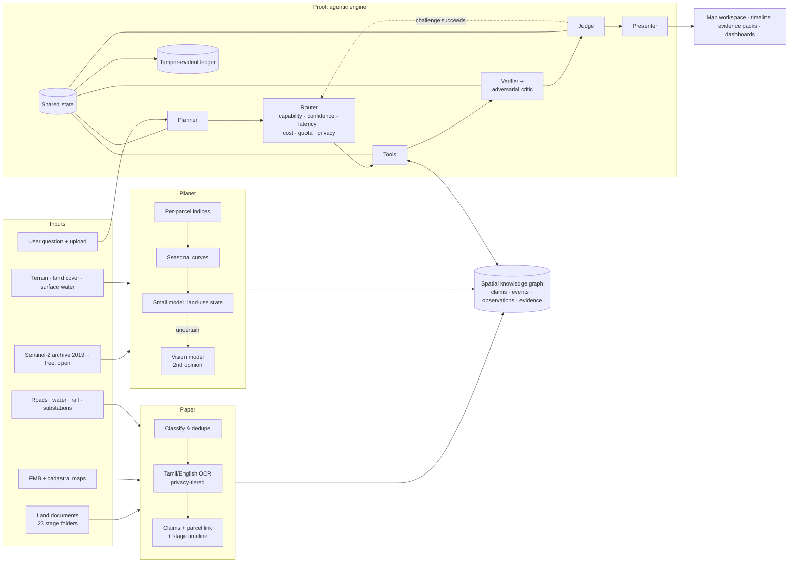

# NilaSaatchi AI (நிலச் சாட்சி: "the land's witness")
### Paper vs Planet: an agentic AI that cross-examines land-acquisition documents against satellite evidence

| | |
|---|---|
| **Chosen challenge** | **Task 1: Multi-Model, Multimodal and Agentic AI System.** Use case: land-document and parcel intelligence, built on the Task 2 dataset, with a satellite-evidence layer |
| **Project title** | NilaSaatchi AI: Paper vs Planet |
| **Team** | MindSpark (4 members) |
| **Study area** | Allikulam SIPCOT industrial park, Thoothukudi, Tamil Nadu (7 villages, 1,242 surveyed parcels, about 908 ha) |
| **Prototype window** | 2 weeks after shortlisting |
| **Model policy** | Free-tier and open models only. AI cost: ₹0 |
| **Version** | Proposal v2.0 · 2026-09-26 |

---

## 1. Executive summary

> *The Land Delivery Certificate says Melathattaparai survey 233 was handed over to SIPCOT on **21 March 2025**. The satellite says the same field turned green again in **December 2025**, with the same seasonal cycle it had before acquisition (NDVI 0.76).*

We found this in the provided data, using free satellite imagery, before writing this proposal. But green alone doesn't prove farming: after the north-east monsoon almost every field in Thoothukudi turns green, weeds included. So NilaSaatchi doesn't ask "is it green?". It asks **"does this acquired parcel still behave like active farmland nearby that was never acquired?"**, comparing each parcel against a control group of non-acquired fields under the same rain and looking for a ploughing signature (bare soil just before the green-up). In our first, simple test, **444 of 1,073 parcels** with enough clear pixels show a crop-like seasonal cycle both before acquisition and after possession.

Land acquisition produces thousands of documents. Every one of them makes **claims about the land**:
- this is dry land, not wet
- these trees were compensated
- possession was taken on this date
- this parcel is now in SIPCOT's land bank

Today no one routinely checks those claims against what actually happened on the ground. The land, however, has a witness: satellites photograph every parcel every five days, and the archive goes back to 2019.

**NilaSaatchi AI** is an agentic system with three pillars:
1. **Paper.** It reads scanned Tamil and English acquisition documents and extracts every claim, with the exact page location as evidence.
2. **Planet.** It builds a per-parcel satellite history and classifies each season: cropped, irrigated, trees or scrub, fallow, cleared or built.
3. **Proof.** It cross-examines paper against planet, tries hard to prove its own findings wrong, and produces **evidence packs** that an officer can act on or send for field verification.

It is built on a reusable agent architecture: a planner, a model router across free proprietary and open models, verification, fallback and an audit trail. We demonstrate that reuse by pointing the same engine at a second FarmwiseAI use case: **"Was a crop grown on this farm in this season?"** That is the core question behind crop-insurance claim verification, agricultural-loan monitoring and digital crop surveys.

---

## 2. Why this idea, for FarmwiseAI

We researched FarmwiseAI's public profile and the student-hackathon landscape before choosing.

| What we found | What it means |
|---|---|
| FarmwiseAI's site shows a GeoAI/satellite company: MapsAI crop intelligence, crop-insurance claim verification, loan-utilisation checks by satellite, and a GIS land-acquisition product line. SIPCOT and the Survey & Settlement directorate appear among its logos | Satellite verification of land claims is FarmwiseAI's DNA. We extend it to a new, high-value domain |
| Land-document OCR → parcel dashboards are **very common**: many Smart India Hackathon 2026 projects, and an official SIH problem on land-acquisition management systems | We keep that layer as the *foundation*, not the headline |
| Crop-advisory chatbots are the most common student idea, and FarmwiseAI already sells crop and pest advice | We avoid that space |
| No product found systematically checks acquisition documents against a satellite time series | **A real gap, and a natural product for FarmwiseAI** |
| Our spike: free Sentinel-2 data gave 587 acquisitions of the park (2019–2026, 122 nearly cloud-free) and per-parcel results for the whole park in minutes on an ordinary computer | **Feasible**, with no paid data and no GPU |

**The value to FarmwiseAI:**
- a new application for its land-acquisition customers (SIPCOT and other industrial corporations, railway and road corridors)
- a verification engine shared with its agri-claims products
- a demonstration of cost-controlled, multi-model agentic AI, the capability it is currently hiring for

---

## 3. Our understanding of the problem

### 3.1 In our own words
Land acquisition in Tamil Nadu moves through about ten legal stages:
1. a gazette notification (s.3(1))
2. notices to owners and corrections (s.3(2), errata)
3. price committees (DLPNC/SLPNC)
4. a possession notice (Form E)
5. an award (s.7(2) by consent, s.7(3) without consent)
6. a compensation apportionment (Form F)
7. payment or a court deposit
8. a land-delivery certificate
9. transfer of the land record (patta) to SIPCOT

Each stage produces documents, and each document asserts facts about specific parcels.

This raises three problems:
1. **The facts are locked in paper.** The documents are scanned, mostly Tamil, with key facts in tables and some handwriting. They are filed by stage, often duplicated or misfiled, and nothing links them to the parcel map.
2. **The facts are never checked against the ground.** Whether land was actually dry or irrigated, whether compensated trees existed, whether possession changed anything on the ground, and whether acquired land is being used: all of this is taken on trust.
3. **Trust needs evidence.** Any automated finding about a farmer's land or a government record must show its sources, its confidence and its limitations. Otherwise, no one can act on it.

### 3.2 What we found in the actual data
| Finding | Number | What it means for the design |
|---|---|---|
| Documents | 3,212 PDFs, **2,361 unique** (851 exact duplicates; 186 filed in two or more stage folders) | Deduplicate by content |
| Pages | 18,644, of which **12,564 are unique**; mostly scanned Tamil | Bulk reading must be local and free |
| Foreign documents | A *Solar Power Plant (Tirunelveli)* gazette is mixed into the Allikulam folders | Classify documents by content and check scheme relevance |
| Totals disagree | The proposal asked for **911.395 ha**; the Government Order and sanction letter approved **904.40 ha** | Detect document drift automatically |
| Parcel-map quality | The 1,242 digitised FMB parcels **overlap each other in 366 places (7.3 ha counted twice)**; 28 parcels spill outside their survey | Automatic QA of digitised/georeferenced FMB maps, a FarmwiseAI product line |
| Built-in arithmetic | Award = acres × negotiated rate (2.52 ac × ₹5,00,000 = ₹12,60,000) | A free, exact verification check |
| OCR test | Free Tamil OCR reads paragraphs well but garbles table cells | Route cheap OCR first, and use AI vision only for tables |
| **Satellite test** | 587 Sentinel-2 acquisitions of the park, 2019–2026 (122 nearly cloud-free). The park's median NDVI is 0.71 after the monsoon (Dec 2021) and 0.68 (Dec 2025); dry-season values are 0.2–0.4 | Strong seasonal signal. Parcel-level histories are feasible |
| **Paper vs Planet signal** | **444 of 1,073** analysable parcels green up both before acquisition and after possession. Our full seasonal model then showed that almost all parcels green up after the monsoon, weeds included, so the prototype tests each parcel **against a control group of never-acquired farmland** and a ploughing signature instead of greenness alone | A real, demonstrable finding that needs field verification |

---

## 4. What we will build and what we will demonstrate

### 4.1 The product: one map workspace
- A **command bar** that accepts English or Tamil and file uploads (PDF, GeoJSON).
- A **live plan view**: each step, the AI model or tool chosen and why, its time and its cost.
- A **map** of every parcel, coloured by finding, land-use state or acquisition stage, with a **season slider** that replays 2019 to today.
- **The Paper-vs-Planet timeline**, our signature view. For any parcel, the document events (notification → award → payment → possession) are laid over the satellite vegetation curve, so the mismatch is visible at a glance.
- **Evidence packs.** The original Tamil document excerpt with the value highlighted, satellite images at the key dates, the checks performed, the AI's own attempt to disprove the finding, the verdict, the confidence and the caveats. Exportable as PDF.
- **KPI cards, charts and a findings table**, all linked: clicking one filters the others.
- **Save, reopen, version and export** workspaces. Modify them in plain language ("add idle land by block").
- A **verification, audit and review panel**, including a tamper-evident log.

### 4.2 Demonstration outcomes
1. **One parcel, cross-examined.** "Verify Melathattaparai survey 233." The system shows the documents' claims, what the satellite saw, and a verdict with evidence.
2. **Park-wide sweep.** "Which parcels are still cultivated after possession?" The result is ranked, mapped and packed with evidence.
3. **Compensation integrity.** "Did land use change between notification and award?" This detects, for example, sudden planting that would inflate compensation. The reverse check protects farmers: trees that were visible but never compensated.
4. **Idle land bank.** "How much acquired land is unused, by block, and what is its road and power access?"
5. **Document drift.** "Do the proposal, the sanction and the map agree?" The system explains the 911.395 ha proposed vs 904.40 ha sanctioned, with sources, and flags the 366 overlapping parcel pairs that make naive map totals unreliable.
6. **New document (Task 2 Example A).** Upload an award. The system extracts it, matches it to parcels and cross-examines every row.
7. **Reuse for agriculture.** Upload any farm plots and ask for crop presence per season and fallow streaks. This is the same engine used for crop-insurance and loan checks.
8. **Resilience.** A provider is switched off live and the system reroutes. A tampered record breaks the audit chain.
9. **An unseen request** from the evaluators.

---

## 5. Solution approach

**Principle: cheapest reliable step first, verify what matters, always show the evidence.**

| Pillar | How it works |
|---|---|
| **Paper** | Deduplicate and classify documents by content. Read digital text, or run local Tamil+English OCR. Detect tables and read them cell by cell. Escalate only uncertain cells to AI vision, and to human review as a last resort. Normalise units, survey numbers and names. Link each fact to its FMB parcel. Build each parcel's legal-stage timeline |
| **Planet** | Fetch every Sentinel-2 scene from 2019 on (free, open). Compute cloud-masked vegetation, water and bare-soil indices per parcel. Smooth them into seasonal curves. A **small local model** classifies each parcel-season. It was trained from labels produced by a large **vision model acting as teacher**, cross-checked against the ESA land-cover map. Uncertain cases go back to the vision model for a second opinion |
| **Proof** | An agent plans the investigation and runs six **Paper-vs-Planet checks** (§8) plus ten document checks. A critic from a different AI vendor must propose a *testable* reason each finding is wrong, and the system runs that test. A judge accepts, downgrades or sends the finding to field verification |

---

## 6. System architecture

| Component | Role |
|---|---|
| Planner | Turns a request into a checked step plan, and asks when information is missing |
| Router | Chooses the model for each step and logs *why*. Enforces free quotas and privacy, and falls back on failure |
| Pseudonymisation gateway | Replaces owner names and amounts with tokens before any content reaches a provider that may train on it |
| 13 tools | Document search and extraction, guarded SQL, spatial queries, parcel matching, lifecycle, satellite time series, satellite image chips, land-use state, Paper-vs-Planet checks, evidence packs, dashboard composition |
| Verifier, critic and judge | Deterministic checks, then a cross-vendor adversarial challenge, then a calibrated verdict |
| Shared state and ledger | Every step checkpointed. A SHA-256 hash chain makes results tamper-evident |

---

## 7. Models, tools and technology stack

### 7.1 Models: every model has one justified role, and all are free
| Model | Type | Role | Why |
|---|---|---|---|
| **Google Gemini Flash-Lite / Flash** (free tier) | Proprietary #1 | Planner, judge, narrative. **Visual teacher and second opinion on satellite images** | Strong reasoning and vision. Satellite images contain no personal data, so this use is privacy-safe. Receives document content only after pseudonymisation |
| **Cohere Command A + Command A Vision** (trial) | Proprietary #2 | Adversarial critic and judge fallback; **independent second vision teacher** on satellite images | A second vendor makes the critic independent of Gemini. Two teachers from different vendors must agree before a label trains our small model |
| **Qwen3.8-27B / gpt-oss-120b** (open weights, Groq free tier) | Open-weight | Text-to-SQL, structured extraction, **second reader for document tables containing personal data** | Fast, strict JSON, no training on inputs, so it may see owner pages |
| **LightGBM land-use "student"** (trained by us) | Small local model | Classifies every parcel-season | Runs thousands of classifications for free. The VLM teacher is used only when needed |
| **PaddleOCR (Tamil) + Tesseract** | Open-source, local | Bulk OCR of 12,564 pages | Unlimited and private |
| **BGE-M3** | Open-source, local | Multilingual document search | Private and free |
| **Ministral 3 8B + 3B** (AWS Bedrock, FarmwiseAI event account) | Open-weight, hosted in Mumbai | **8B vision reads Tamil document tables containing personal data**; 3B classifies documents and repairs JSON | AWS does not train on customer data, so owner pages stay private. In our test, 8B read every number in a Government Order table correctly in 3 seconds |
| **Amazon Titan Text + Multimodal Embeddings** (AWS Bedrock) | Proprietary #3 | Document search; similar-image search over satellite chips and pages | Inside FarmwiseAI's approved AWS stack |

**"Small model first" appears twice, by design:**
- documents: local OCR (headers) → Ministral 3 8B vision on AWS (tables) → Qwen vision → human
- satellite: the small student model → the Gemini teacher, cross-checked by Cohere Vision → field verification

The route panel shows every decision with its latency and a **shadow cost**: what the same work would cost at commercial list prices, compared with sending everything to a large model. The actual cost is ₹0.

### 7.2 Technology stack
| Layer | Tools (all free or open-source) |
|---|---|
| Agent framework | LangGraph, Pydantic, LiteLLM |
| Backend | Python 3.12, FastAPI, server-sent events |
| Data | PostgreSQL + PostGIS, pgvector |
| Satellite and geo | Sentinel-2 via the open Earth Search catalogue, rasterio, GeoPandas, Shapely, LightGBM; Copernicus DEM, ESA WorldCover, JRC Surface Water |
| Documents | PaddleOCR, Tesseract, OpenCV |
| Frontend | React (JavaScript), MapLibre (free basemap), ECharts, pdf.js |
| Quality | pytest, Playwright, recorded model responses (tests use no quota) |
| Cloud | **AWS Mumbai (FarmwiseAI event account):** Bedrock (Ministral 3, Titan embeddings), private S3, DynamoDB, Lambda + API Gateway serving the live app, CloudWatch. Self-imposed spend cap: US$15 of the US$100 budget |

---

## 8. Innovation

1. **Paper vs Planet cross-examination.** To our knowledge, this is the first system that systematically tests land-acquisition documents against a multi-year satellite record. It runs six checks:

   | Check | Question |
   |---|---|
   | Classification | Was "wet land" ever irrigated? Is "government poramboke" being cultivated? |
   | Standing assets | Did compensated trees exist? Were visible trees left uncompensated? *This protects farmers too.* |
   | Post-possession activity | Is land "handed over" on paper still being farmed? |
   | Idle land bank | Is acquired land actually being used? |
   | Pre-notification change | Did land use change suspiciously while acquisition was pending? |
   | Water conflict | Is "dry land" actually waterlogged or part of a tank? |

2. **Evidence packs built for scrutiny.** Courts and officers treat imagery alone as inconclusive. Our packs pair the *document evidence* (the Tamil original, highlighted) with the *satellite evidence* (dated images and indices), the AI's own counter-argument, the confidence and the caveats.
3. **A self-critical agent.** Deterministic arithmetic and satellite checks come first. Then a critic from a different AI vendor must propose a testable way the finding could be wrong (for example "the green-up is monsoon weeds, not a crop"), and the system runs that test.
4. **A vision model that teaches a small model.** The large model labels a few hundred satellite samples. A small local model learns from them and handles every parcel-season for free. The large model is used again only when the small one is unsure.
5. **Privacy-tiered, zero-cost routing.** Free tiers are managed as a budget. A pseudonymisation gateway lets strong free models help with personal-data cases without seeing names.
6. **One engine, two FarmwiseAI markets.** The same agent serves land acquisition and agri-claims (crop presence and fallow checks for insurance, lending and crop surveys) through swappable domain packs.
7. **AI-built, human-governed.** The prototype is implemented by specialised AI coding agents under the team's review, with independent quality gates.

---

## 9. Business case

### 9.1 Stakeholders and value
| Stakeholder | Value delivered |
|---|---|
| **SIPCOT** | Know which possessed land is actually free, idle or still farmed. Plan allotments on ground truth. Spot encroachment early |
| **Land Acquisition officers (DRO / Special Tahsildar)** | One place to see every parcel's stage, documents and exceptions. Evidence-backed checks before awards and handovers |
| **District Collector** | Village and block dashboards of progress, idle land and flagged findings, with sources |
| **Landowners and farmers** | Protection against under-compensation (unrecorded trees, wrong land class) and faster exception handling |
| **Auditors** | Independent, reproducible, tamper-evident evidence for compensation and possession claims |
| **FarmwiseAI** | A new product for its land-acquisition line, and a verification engine shared with its crop-insurance, lending and crop-survey products |

### 9.2 Current state and future state
| Today | With NilaSaatchi |
|---|---|
| Documents filed in 23 folders, duplicated and misfiled | Classified, deduplicated and linked to parcels automatically |
| Scanned Tamil tables read by hand | Local OCR plus selective AI, with evidence boxes |
| Document claims taken on trust | Every key claim tested against a satellite record from 2019 |
| Possession recorded on paper only | Ground activity monitored after possession |
| Idle land unknown | Idle land bank by block, with access data |
| Findings hard to defend | Evidence packs with sources, confidence, counter-arguments and an audit chain |

### 9.3 Benefits: illustrative estimates, to be validated with FarmwiseAI
| Metric | Manual (assumption) | With NilaSaatchi (target) |
|---|---|---|
| Reconcile one parcel across documents and map | ~25 min | Under 1 min automated; ~5 min human review, for flagged parcels only |
| Full reconciliation of 1,242 parcels | ~520 person-hours | ~25 hours of exception review (assuming about 20% flagged) |
| Check a parcel's ground condition | A field visit (hours, plus travel) | Seconds, from a 7-year satellite history. Field visits only for flagged parcels |
| Park-wide post-possession activity scan | Rarely done | Minutes, repeatable every season |
| AI running cost | — | ₹0 on free tiers; shadow cost reported |

*These are planning assumptions, not measurements. The prototype will measure its own accuracy, speed and flag rate and report them honestly.*

### 9.4 Cost of the prototype
| Item | Cost |
|---|---|
| AI models | ₹0: free tiers and local models |
| Satellite data | ₹0: Copernicus Sentinel-2 open data |
| Compute | Existing computer, CPU only |
| AWS | Estimated US$5–12; self-imposed cap US$15 of the US$100 event budget |

### 9.5 Scalability and roadmap
- **More sites:** 17 other SIPCOT sites are already in the district layer. The same approach applies to road, rail and port corridors, where FarmwiseAI already works.
- **More claims:** crop-insurance claims, crop-loan use, and digital crop-survey entries, through the agri-claims pack.
- **Better sensing:** Sentinel-1 radar for the monsoon months, and FarmwiseAI's drone imagery for close-up evidence.
- **Better models:** the router automatically benefits from new free models, because models are configured, not hard-coded.

### 9.6 Success criteria (prototype)
| Area | Target |
|---|---|
| Document classification | ≥ 90%; all known foreign-project documents flagged |
| Extraction (priority tables) | Survey numbers ≥ 92%, extents ≥ 90%, owners ≥ 85%, land class ≥ 90%, possession dates ≥ 95% |
| Parcel matching | Precision ≥ 95%, recall ≥ 85% |
| Satellite land-use classifier | Macro-F1 ≥ 0.80 on held-out villages; ≥ 85% agreement with an independent image audit |
| Findings | ≥ 80% precision in an independent evidence audit; the verifier catches ≥ 70% of seeded errors |
| Agent | Valid plans ≥ 95%; unseen-request score ≥ 85% |
| Resilience and privacy | 100% of failure drills recover; 0 personal-data leaks to training-tier providers |
| Speed | Typical answer in ≤ 25 s |

---

## 10. Requirements summary (for the business analyst)

### 10.1 Functional requirements
| ID | Requirement |
|---|---|
| FR-01 | Accept English and Tamil requests, with PDF, image, GeoJSON or CSV uploads |
| FR-02 | Show an explicit plan and live step progress, with the model or tool choice and its reason |
| FR-03 | Extract survey, subdivision, owner, extent, land class, standing assets, amounts and dates from documents, with page-and-box evidence |
| FR-04 | Match document records to FMB parcels, with candidates and confidence |
| FR-05 | Maintain each parcel's acquisition-stage timeline across 10 stages |
| FR-06 | Build per-parcel satellite histories (2019→) and seasonal land-use states, with confidence |
| FR-07 | Run the Paper-vs-Planet checks (6) and document checks (10), producing findings with caveats |
| FR-08 | Produce evidence packs (UI and PDF) that combine document and satellite evidence |
| FR-09 | Show the synchronised map (with season slider), timeline, document viewer, KPIs, charts and table |
| FR-10 | Modify, save, reopen, version and export workspaces (GeoJSON, CSV, PDF, JSON) |
| FR-11 | Answer attribute and multi-layer spatial queries, and show the generated SQL or operations |
| FR-12 | Answer crop-presence and fallow queries for arbitrary uploaded polygons (agri-claims pack) |
| FR-13 | Verify key claims; route uncertain ones to human or field-verification queues |
| FR-14 | Record every step in a verifiable, tamper-evident ledger |

### 10.2 Non-functional requirements
| ID | Requirement |
|---|---|
| NFR-01 | Free models and open data only. Every model call goes through the router |
| NFR-02 | Personal data is never sent to providers that train on free-tier inputs |
| NFR-03 | No hard-coded answers. The system handles unseen requests |
| NFR-04 | Typical answer ≤ 25 s; workspace first render ≤ 2 s |
| NFR-05 | Graceful degradation on provider failure or quota exhaustion |
| NFR-06 | Findings use neutral language ("signal needing field verification") and always show their caveats |
| NFR-07 | Reproducible pipelines; offline tests |
| NFR-08 | FarmwiseAI-provided data is clearly separated from team-sourced data |
| NFR-09 | Owner names are masked in demo and public material |

### 10.3 Key user stories
- *As a SIPCOT officer,* I want the list of possessed parcels that still show cultivation, so that I can plan field verification and allotment.
  - **Accepted when** each parcel opens an evidence pack with its handover certificate and dated satellite images.
- *As an LA officer,* I want to know whether land use changed between notification and award, so that compensation is fair.
  - **Accepted when** every flag shows the before and after states, dates, confidence and caveats.
- *As a compensation auditor,* I want parcels where the land class or tree compensation disagrees with the satellite history.
  - **Accepted when** the document line and the satellite evidence appear side by side.
- *As a Collector,* I want idle acquired land by block, with road and power access, saved as a weekly dashboard.
  - **Accepted when** it reopens identically and its audit hash verifies.
- *As an agri-claims analyst,* I want crop presence per season for uploaded farm plots.
  - **Accepted when** each season shows a yes/no, the confidence and the satellite chips.

---

## 11. Data, resources and access required
| Resource | Source | Status |
|---|---|---|
| Land-acquisition documents, GO/AS/LPS | FarmwiseAI | ✅ Received and analysed |
| FMB, cadastral, boundary and basic GIS layers | FarmwiseAI | ✅ Received and analysed |
| Sentinel-2 L2A archive 2019→ | Copernicus open data via the Earth Search catalogue (no account) | ✅ Tested: 587 acquisitions, 122 nearly cloud-free |
| Copernicus DEM, ESA WorldCover, JRC Surface Water | Free public sources | Planned Day 1–3 |
| AI model access: Gemini, Groq, Cohere | Free tiers, no billing method | ✅ All verified live |
| AWS: Bedrock (Ministral 3 3B/8B, Titan), S3, DynamoDB, Lambda, API Gateway | FarmwiseAI event account, team 49, Mumbai | ✅ Access verified; Bedrock vision tested |
| **Requests to FarmwiseAI** | | |
| 1. Confirmation that no-training cloud AI processing of the documents is acceptable | | Open question |
| 2. Any field-verified parcel observations (even 20–30) to calibrate the satellite findings | | Would strengthen validation |
| 3. Data dictionary for unit/block numbering and stage definitions | | Nice to have |

---

## 12. Project plan: 2 weeks
| Days | Milestone | Key activities | Deliverable |
|---|---|---|---|
| 0–1 | **Setup and spikes** | Environment, model access checks, OCR bake-off, re-run of the satellite spike | Running stack; measured routing thresholds |
| 1–3 | **Data foundation** | Catalogue and deduplicate documents; classify; load map layers; reconcile totals; terrain, land cover and scene inventory | Knowledge-graph base |
| 2–7 | **Paper** | Tamil/English OCR; priority-table extraction; land class, assets and possession dates; matching and lifecycle | Parcel claims with evidence |
| 2–6 | **Planet** (in parallel) | Per-parcel indices for all scenes; seasonal features; teacher labels; small-model training | Parcel-season land-use states |
| 4–8 | **Agentic core** (in parallel) | Planner, router, tools, gateway, verifier, critic, judge, state, ledger, API | End-to-end agent runs |
| 7–11 | **Proof** | Paper-vs-Planet and document checks; evidence packs; drift; idle land bank; agri-claims pack | All demo findings |
| 7–11 | **Workspace** | Map + season slider, timeline, evidence packs, dashboards, save/export | Interactive prototype |
| 11–13 | **Validation and demo** | Full evaluation, audits, route/cost comparison, failure drills, documentation, rehearsals | Evaluation report and demo |

Every milestone ends with a **quality gate**: tests pass, metrics are recorded, an independent review is done, and the team signs off.

---

## 13. Team and responsibilities
Each member **owns** a workstream: they set its direction, review its output and accept or reject its results. Implementation is carried out by specialised **AI coding agents** (Claude Code) under their supervision. An independent AI evaluator checks every milestone before a human signs it off.

| Member | Role | Owns and reviews | AI agents supervised |
|---|---|---|---|
| **Shivani R** | Team lead · Agentic AI | Planner, router, verification, ledger, quality gates | Agent architect, QA evaluator |
| **Mohana G** | Document intelligence (Paper) | Tamil/English OCR, claim extraction, accuracy | Document-intelligence engineer |
| **Sevandhi S** | GeoAI & satellite (Planet + Proof) | Satellite pipeline, land-use model, matching, checks, evidence packs | Earth-observation engineer, GIS engineer, data engineer |
| **Preethi Shri R** | Product, frontend & backend | Workspace, timeline, API, exports, documentation, demo | Frontend engineer, backend engineer, docs writer |

---

## 14. Risks and mitigations
| Risk | Mitigation |
|---|---|
| Satellite ambiguity (weeds vs crops, cloud gaps, small parcels) | Multi-index agreement, seasonal shape, neighbour comparison, vision second opinion, low-support flags. Findings framed as leads for field verification |
| No field ground truth | Teacher labels plus an independent image audit plus land-cover agreement. We ask FarmwiseAI for any field observations |
| Sensitive findings | Neutral wording, confidence and caveats on every finding, and human review before anything is marked "for action" |
| Tamil table OCR accuracy | Cell-level reading, two-engine voting, an independent second reader, arithmetic checks, review queue; priority-document scope |
| Free-tier limits change | Configured models, daily checks, fallback chains, recorded responses |
| Personal-data privacy | Privacy-tiered routing, a pseudonymisation gateway, an automatic leak audit |
| Schedule | Parallel pillars, milestone gates, a pre-agreed cut list |

---

## 15. Before vs after
| Aspect | Today | With NilaSaatchi AI |
|---|---|---|
| Finding a parcel's documents | Search 23 folders | One question |
| Reading Tamil scans | Manual | Local OCR plus selective AI, with evidence |
| Verifying document claims | On trust | Tested against a 7-year satellite record |
| After possession | Unknown | Ground activity and idle land monitored |
| Compensation fairness | Paper-only | Land class and trees cross-checked, in both directions |
| Model choice | Not applicable | Routed by capability, confidence, speed, cost, quota and privacy |
| Traceability | Limited | Evidence packs and a tamper-evident ledger |
| AI cost | — | ₹0 |

---

*Engineering plan: `plan.md`. Spike evidence: `docs/spikes/sentinel2-spike.md`. Domain reference: `.claude/skills/land-domain-knowledge/SKILL.md`.*

---

## Appendix: Status / measured results (2026-09-28)
Built and running. Every number was measured (details in docs/metrics.md, decisions in docs/decisions.md).
- **Live:** read-only cloud demo on AWS Lambda + API Gateway (Mumbai), https://lv7b9630q6.execute-api.ap-south-1.amazonaws.com/. The full app runs locally with `make demo`. Code: https://github.com/sevandhi/nilasaatchi-ai.
- **Knowledge graph:** 2,362 documents, 26,269 extracted rows, 42,380 facts, 15,342 acquisition events, 1,242 parcels (87% with document facts), 382,536 satellite observations (2019 → 2026-09-26), 1,388 findings with evidence packs.
- **Accuracy (unseen pages):** survey 89.5%, owner 83.3%, extent 79.2%, headers 91.1%. That is below the stated targets, so uncertain rows go to a human Review queue.
- **Agent:** 8/8 answers match SQL references (including unseen and Tamil questions); the critic is always another vendor; the audit ledger is verified.
- **New data:** uploads processed end to end (20/20 unseen documents, 387 parcel links) with a downloadable verification report. An incremental Sentinel-2 refresh added the 2026-09-26 scene.
- **Privacy:** 0 of 14,202 owner-data (PII) model calls went to a model that trains on inputs.
- **Cost:** AWS Cost Explorer US$0.79 (router estimate ~US$8) of the US$100 event budget; all other models on free tiers.
- **Findings audit:** 37/37 claims follow from their evidence; on the scanned pages extent mismatches were 5/5 and compensation mismatches 1/5 (now presented as leads).
- **Routing comparison (8 questions):** routed 8/8 valid plans, 84.9% verified, 41 s median; all-open 0/8 plans, no verification, 86 s; all-proprietary 6/8, 90%, 55 s; routed 15% cheaper at list prices.
- **Not met:** planet student macro-F1 0.634 (target 0.80); agent latency ~41 s (target 25 s); agent answers vs SQL varied 8/8 → 3/8 between runs.
