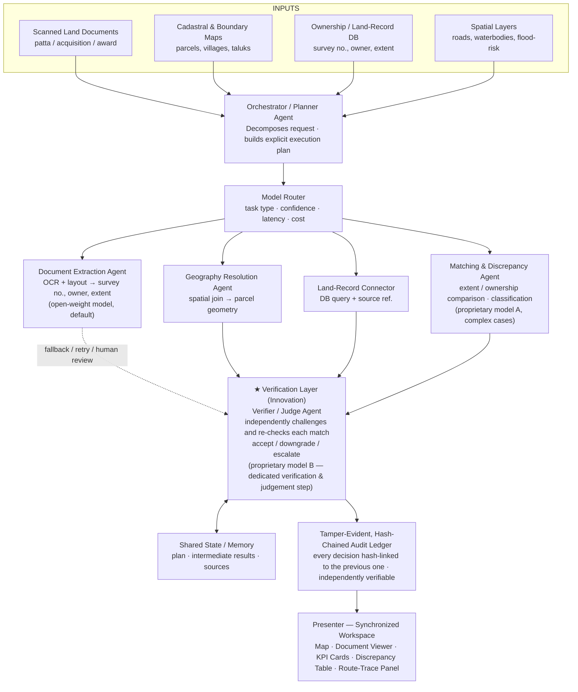
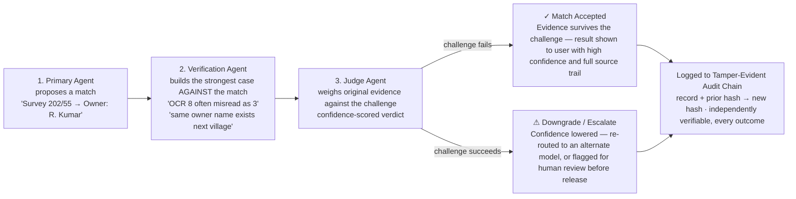

# Multi-Model, Multimodal and Agentic AI System

| | |
|---|---|
| **Project Title** | ParcelSense AI — An Agentic Multimodal System for Land-Document and Parcel Intelligence |
| **Chosen Challenge** | Task 1 — Multi-Model, Multimodal and Agentic AI System (Land Document & Parcel Intelligence use case) |
| **Team Name** | MindSpark |
| **Team Size** | 4 members |

---

## 1. Project Objective

- **Reusable Agentic AI Architecture**: Build a generic architecture implemented for land-document and parcel intelligence.
- **Multimodal Inputs**: Accept scanned land documents, cadastral maps, database records and spatial constraints.
- **Intelligent Planning**: Decompose user requests into smaller executable tasks.
- **Multi-Model Routing**: Dynamically route each task to the most suitable proprietary or open-weight AI model.
- **Tool Integration**: Connect OCR, databases, GIS and spatial-analysis tools.
- **Adversarial Verification**: Actively try to disprove AI-generated results instead of simply confirming them.
- **Tamper-Evident Audit Chain**: Maintain a traceable record of model decisions, evidence and verification steps.
- **Map-Based Results**: Present the final answer with parcel visualization and supporting evidence.
- **Discrepancy Detection**: Identify inconsistencies between documents, databases and spatial records.
- **Reusable Design**: Work with new documents, parcels and spatial questions without hard-coded workflows.
- **One-Week Prototype**: Deliver a functional demonstration of the complete multi-model agentic pipeline within the hackathon timeframe.

---

## 2. Our Understanding of the Problem

Land records in most Indian districts exist as scattered, disconnected artefacts: scanned patta and acquisition documents, cadastral survey maps, ownership databases maintained by different departments, and spatial layers such as roads, waterbodies and flood-risk zones. Today, verifying something as simple as "does the extent written in this acquisition document match what is actually surveyed on the ground, and who really owns it" requires a person to manually read a scanned PDF, look up a separate database, open a GIS map, and reconcile all three by hand. This is slow, error-prone, and does not scale across a district with thousands of parcels.

The underlying technical problem, in our own words, is threefold:

- **Multimodal extraction** — turning unstructured, often low-quality scanned documents into structured, verifiable fields (survey number, owner, extent, document type).
- **Entity resolution across sources** — the same parcel is referred to inconsistently across the document, the cadastral map and the database (naming variants, subdivision splits, transliteration differences), so the system must resolve these before it can compare anything.
- **Orchestrated reasoning with verification** — no single model is well-suited to every step (OCR-heavy extraction, geospatial matching, numeric comparison, natural-language explanation), so the system needs a planner that assigns the right step to the right model/tool, and a verifier that catches an incorrect match, a misread number or a low-confidence OCR result before it reaches the user.

We treat this explicitly as an instance of the general architecture Task 1 asks for — planner, router, connectors, verifier, fallback, shared state — rather than as a bespoke land-records tool. The same skeleton should be re-pointable at another domain with minimal change.

---

## 3. What We Propose to Build and the Outcome We Intend to Demonstrate

Within one week, we will build one working web application in which a user uploads or selects a scanned land document (e.g. an acquisition notification or award statement) together with a target village/parcel context, and issues a natural-language request. The system will:

1. Interpret the request and identify what is being asked, what inputs are available, and what is missing.
2. Generate an explicit execution plan naming the agents, tools and models required.
3. Extract structured fields from the scanned document (survey numbers, owners, extents, document type) using OCR and document-understanding models.
4. Resolve village/taluk/survey-number naming variants and link each extracted record to the correct cadastral parcel geometry.
5. Query the ownership/land-record database and compare document-stated values against GIS extent and registry ownership.
6. Classify and surface discrepancies (missing from map, missing from database, extent mismatch, ownership mismatch) with confidence scores.
7. Challenge the most important outputs with the Devil's-Advocate verifier, judge whether the match survives, and demonstrate at least one fallback path (retry, alternate model, or human-review flag) when the challenge succeeds.
8. Present one synchronized result: a map highlighting the parcel(s), a discrepancy table, KPI cards and a short natural-language explanation, all backed by a visible route trace (which model/tool handled each step, its confidence, latency and estimated cost).

The demonstrated outcome will be: **(a)** the detailed document-to-parcel matching scenario end-to-end, and **(b)** a second, spatially-constrained query (e.g. government parcels above a size threshold near a road, excluding flood-risk zones) answered by the same underlying architecture — proving reusability rather than a single hard-coded path.

---

## 4. Proposed Solution Approach, System Architecture, Models, Tools and Technology Stack

### 4.1 Architecture Overview

The system follows a **planner → router → executor(s) → verifier → presenter** pipeline, with a shared state object that persists across the whole request:

- **Orchestrator/Planner agent** — receives the natural-language request plus attached files, classifies intent, identifies missing inputs, and produces an explicit step-by-step plan (JSON) naming the agent/tool required for each step.
- **Model Router** — for each planned step, selects a model based on task type, required capability (e.g. layout-aware OCR vs. multimodal reasoning), confidence needed, latency budget and estimated cost. Routine, well-defined steps default to the open-weight model; complex, ambiguous or multimodal-reasoning steps escalate to a proprietary model.
- **Document Extraction Agent** — OCR + layout understanding to pull structured fields from the scanned document.
- **Geography Resolution Agent** — normalises place names and survey-number variants and resolves them to the correct cadastral geometry (spatial join).
- **Land-Record Connector** — queries the ownership/registry database for the resolved parcel(s) and preserves the source record reference.
- **Matching & Discrepancy Agent** — compares document, database and GIS values; classifies discrepancy type; computes confidence.
- **Presenter** — assembles the verified outputs into the map, table, KPI cards and explanation for the front end, and logs the full route trace to shared state.

### 4.2 Model Assignment and Routing Logic

At least three models will be used, each with a distinct, justified role rather than sending the same prompt to all of them:

- **Open-weight/smaller model (default first pass)** — handles routine OCR post-processing, field normalisation and straightforward parcel matches, since these are high-volume, well-defined tasks where a smaller model is fast and inexpensive.
- **Proprietary model A (planning & multimodal reasoning)** — used by the orchestrator for request decomposition, plan generation and reasoning over mixed text/image/map inputs where ambiguity is high.
- **Proprietary model B (Devil's-Advocate verifier & judge)** — invoked on every result the matching agent proposes, not only low-confidence ones, to actively construct the strongest counter-argument against the match and then judge whether the original evidence survives that challenge — see Section 6 for why this differs from a standard confirmatory verifier.

Routing decisions (which model handled a step, why, its confidence, latency and estimated cost) are recorded in shared state and shown in the UI's route-trace panel, directly addressing the evaluation focus on proficiency in LLM/agentic orchestration.

### 4.3 Technology Stack

| Layer | Proposed Tools / Models |
|---|---|
| **Orchestration / Agent framework** | LangGraph (or a custom lightweight planner–executor loop) for explicit plan state, step tracking, and tool-calling; JSON-schema-constrained outputs at every agent boundary. |
| **Proprietary / commercial models** | Two models used for distinct, justified roles: (1) a frontier multimodal LLM (e.g. GPT-4.1 / Claude / Gemini class model) for complex planning and document/map reasoning; (2) a second commercial model dedicated to the Devil's-Advocate verifier and judge, which challenges every proposed match rather than confirming it. |
| **Open-weight / smaller model** | A locally-hosted or low-cost open-weight OCR/layout model (e.g. LayoutLMv3, Donut, or a quantised Llama/Qwen-VL variant) used as the default first pass for document field extraction and routine parcel-matching, escalating to proprietary models only on low confidence. |
| **OCR & document understanding** | Tesseract / PaddleOCR / Donut for scanned-document text and layout extraction; custom post-processing for survey-number and owner-name normalisation. |
| **Geospatial stack** | PostGIS for parcel/administrative-boundary storage and spatial joins; GDAL/Shapely for geometry operations; Mapbox GL JS / Leaflet for the interactive map front end. |
| **Database & retrieval** | PostgreSQL for structured land-record and ownership data; a vector store (pgvector or FAISS) for retrieving similar past discrepancies and advisory references. |
| **Backend & APIs** | Python (FastAPI) microservices exposing the orchestrator, extraction, matching and verification endpoints; async task queue (Celery/Redis) for long-running document batches. |
| **Frontend** | React + Mapbox GL for the synchronized map/document/dashboard workspace; component state kept in sync via a shared query-result context. |
| **Observability** | A lightweight run-trace store (JSON log per query) capturing every step, model/tool used, confidence, latency and estimated cost, rendered in a "route trace" panel. |

### 4.4 Architecture Diagram

---

## 5. Main Components and Capabilities in the Prototype

- **Multimodal ingestion** — accepts scanned PDFs/images of land documents, cadastral map tiles, and structured database exports.
- **Planner/orchestrator** with explicit, inspectable execution plans.
- **Model router** with documented selection rules (task type, confidence, latency, cost).
- **Tool/data connectors**: OCR service, PostGIS spatial-query connector, land-record database connector, map-rendering connector.
- **Structured, schema-validated outputs** at every agent boundary (JSON) that directly drive the map/table/dashboard UI.
- **Devil's-Advocate verifier/critic agent** that actively challenges each proposed match, plus a judge step and a demonstrated fallback/retry path when the challenge succeeds.
- **Tamper-evident, hash-chained audit ledger** recording the plan, every intermediate result, source references and routing decisions, with an independent script that verifies the chain has not been altered.
- **Synchronized map-based workspace**: document viewer, map, KPI cards, discrepancy table and charts, all updated together from one natural-language query.
- **Support for at least one attribute-style query** (document-to-parcel matching) and one multi-layer spatial-constraint query (e.g. proximity to roads, exclusion of flood zones/waterbodies).

---

## 6. Verification Workflow Diagram

**Independent Verification & Judgment Workflow** — *Every proposed match is challenged before it is trusted, not just confirmed.*

> **Why this differs from a standard verifier:** A same-direction verifier re-runs the same reasoning and tends to agree. This agent is instructed only to attack the result — catching confident-but-wrong matches.

---

## 7. Datasets, Maps, Documents, APIs, Cloud Resources and Model Access Required

- **Scanned land documents** — Sample Patta, A-Register, FMB, acquisition and award documents with varying scan quality. *(Source: Tamil Nadu Land Records)*
- **Cadastral & administrative maps** — Survey/subdivision parcel maps and village, taluk and district boundaries in GeoJSON/Shapefile/PostGIS format. *(Source: TNGIS)*
- **Land-record database/API** — Approved/mock records containing survey number, subdivision, owner, extent and parcel ID. *(Source: e-Adangal)*
- **Model access** — API credits for two proprietary multimodal LLMs such as OpenAI and Gemini, plus one open-weight model such as Qwen.
- **Cloud & database** — AWS credits for backend, document storage, PostgreSQL/PostGIS and optional GPU inference. *(AWS | PostGIS)*
- **Evaluation set** — Verified sample documents with correct survey numbers, parcel matches and known discrepancies.
- **Documentation** — Dataset schemas, data dictionaries, API specifications and coordinate-system information.

---

## 8. Project Plan (1-Week)

The plan below compresses the full journey — data understanding, architecture setup, implementation, integration, validation and final demonstration — into a single one-week sprint with a concrete daily milestone and deliverable, so progress and risk are visible every day rather than only at the end.

| Timeline | Milestone | Key Activities | Deliverable |
|---|---|---|---|
| **Day 1** | Setup, architecture & data understanding | Ingest sample scanned land documents, cadastral parcel maps, ownership/registry extracts and administrative boundary layers. Set up cloud environment, proprietary + open-weight model access, vector store and GIS stack (PostGIS/QGIS). Freeze JSON schemas for extracted fields, parcel records, discrepancy objects and the hash-chained audit-log entry. | Environment ready, data dictionary, schema spec v1, audit-chain design note |
| **Day 2** | Document extraction pipeline | Build the OCR + layout-understanding pipeline (survey number, owner, extent, document type). Build the geography-resolution agent to normalise village/taluk/survey-number naming and link to cadastral geometry. | Working extraction agent + geometry-linking agent, unit tests on sample documents |
| **Day 3** | Orchestrator, router & connectors | Implement the planner/orchestrator, model router (proprietary vs open-weight by task/confidence/cost/latency), and tool/data connectors (OCR, DB query, GIS spatial join, map renderer). Wire shared state so every step writes to the audit chain. | End-to-end orchestrated pipeline for the document-to-parcel matching query |
| **Day 4** | Matching, discrepancy engine & Devil's-Advocate verifier | Implement extent/ownership comparison and discrepancy classification. Build the adversarial Devil's-Advocate verifier agent that actively argues against each proposed match, plus the judge logic that only accepts a match once the challenge is answered. Implement the tamper-evident hash-chained audit ledger for every agent decision. | Verified, adversarially-tested discrepancy output; working audit-chain with independent hash-verification script |
| **Day 5** | Map-based synchronized workspace | Build the web workspace: synchronized map, document viewer, KPI cards, discrepancy table and charts. Wire the natural-language query box to the orchestrator so one request updates every view. Add the route-trace panel (model/tool per step, confidence, latency, cost) and an audit-chain verification badge per result. | Interactive prototype UI, fully synchronized |
| **Day 6** | Second scenario, fallback path & hardening | Extend the orchestrator to a second, spatially-constrained query (e.g., government parcels near roads, excluding flood/waterbody zones) to prove reusability beyond one hard-coded path. Force at least one low-confidence case to demonstrate the fallback/retry/human-review path. Fix edge cases (illegible scans, ambiguous survey numbers, multi-owner parcels). | Two distinct query types on the same architecture; demonstrated fallback path |
| **Day 7** | Validation, packaging & demo | Test on an unseen/held-out document set. Measure extraction accuracy, matching precision/recall, router decisions, latency/cost per route, and confirm the audit chain detects a deliberately tampered record. Record the demo walkthrough and finalise documentation/README. | Validated final prototype, demo recording, documentation — ready for review |

---

## 9. Before vs After – Land Parcel Verification

| Aspect | Existing Process | ParcelSenseAI |
|---|---|---|
| **Data Sources** | Documents, GIS & databases handled separately | Documents + GIS + databases + spatial layers unified |
| **Document Processing** | Manual reading and extraction | AI-assisted OCR & document understanding |
| **Parcel Identification** | Manual GIS search | Automated geography/parcel resolution |
| **Record Matching** | Manual comparison | Automated document–GIS–database matching |
| **Model Selection** | Not applicable | Confidence-aware model routing |
| **Error Handling** | Manual correction | Verification + fallback + human review |
| **Decision Confidence** | Difficult to trace | Confidence scores + independent verification |
| **Traceability** | Limited | Full model/tool route trace |
| **Final Output** | Separate information sources | Unified map-based verified parcel intelligence |

---

## 10. Team Members and Responsibilities

The team is organised so that every required architectural component (planner/router, document extraction, geospatial linking, data connectors, verification, and the synchronized front end) has a clear owner, while all members collaborate on integration and end-to-end testing.

| Team Member | Role | Responsibilities |
|---|---|---|
| **Shivani R** | Team Lead / Agentic AI & Orchestration | Owns the planner, model router, and orchestration framework; integrates all agents into one pipeline; coordinates the overall project plan. |
| **Mohana G** | NLP / Document Intelligence Engineer | Builds the OCR and document-understanding pipeline, key-field extraction, and the label/entity normalisation logic for survey numbers, owners and extents. |
| **Sevandhi S** | GeoAI / GIS Engineer | Builds the geography-resolution agent, cadastral-parcel linking, spatial-constraint queries (roads, flood zones, waterbodies) and map rendering. |
| **Preethi Shri R** | Frontend, Backend & Data Engineer | Builds tool/data connectors (database, API, spatial join), shared-state/memory store, and the discrepancy/verification data layer. |
